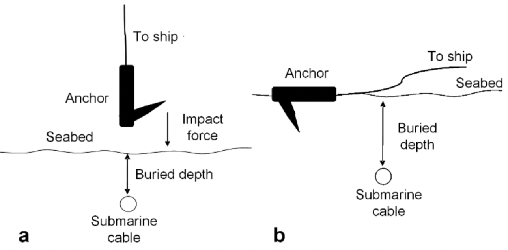
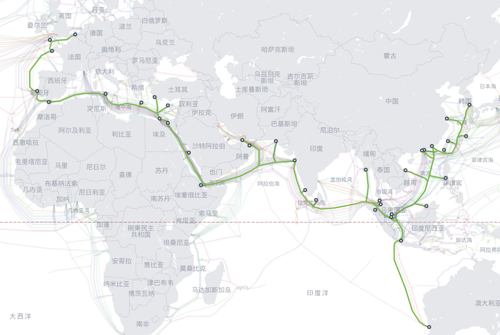

# Cornerstone of global communication: Vulnerabilities of the international submarine telecommunication cable
[toc]
## Research objectives and research question
### Research question
Which country or its subregions are more vulnerable to global internet connectivity due to the submarine telecommunication cable failure?

### Research objectives
1. To review the functionality and importance of STC in the global internet services, justify its development in the past and future project
2. Analysis of in-services STC market, including but not limited to its spatial distribution and services capacity
3. Case study of the 2022 South pacific ocean Tonga Domestic Cable Extension(TDCE) breaks down. Determine the STC which are likely to be affected by the disruption events. 
4. Analysis of the optimal route and identify the availability and cost of the alternative route by considering the internet traffic. 
5. Potential new STC to improve the robustness of the internet services

## Background / Preliminary Literature Review
### Background
As the progress of the information technology on mobile devices combined with the rise of the 5G technology and cloud computing services, the demand for the higher stand internet services can be foreseen. The world needs a medium to transmit big amount of data inexpensively more than ever. As the "high way" of data communication, the optic fibre is the most common tool for wired long-distance data communication.(Kangovi, 2017) There are two types of state level fiber optic cables: fibre optic terrestrial telecommunication cable(TTC) and fibre optic submarine telecommunication cable(STC). In terms of useability, the latter gains a bigger market share. (Marra et al., 2018) Nowadays, STC is responsible for more than 98% of global internet transmission (Winseck, 2017). By estimate, more than 1.2 million KM of STC were constructed. (Wang et al., 2019). In some terms, any internet service depends on STC's functional working in fields like academia, education, entertainment, finance, medication, and the military. Considering the irreplaceability of STC in all aspects of people's daily life, the failure could cause a significant negative impact on the social and economic disruptions on a community or society. 

The failure of an STC might not give inaccessibility of the worldwide internet, as the nature of the internet routing topology, (Calvert, Doar and Zegura, 1997) suggested that the connection can still be obtained by a long and less stable connection. (Turner et al., 2010b). However, it is not true for all the countries. In 2008 a dragging ship anchor damaged either SEA-ME-WE 4 or FLAG, the internet automatically rerouted the data to SEA-ME-WE 3 and overwhelmed its design capacity, which subsequently caused more than 50% of internet services interruption in middle-east area. (Zetter, 2008) More recently, in 2022 the volcano eruption in Tonga caused the failure of Tonga's only STC, which caused the nation to lose almost all communication with the rest of the world for five weeks.(Bateman, 2022) Due to the commercial interest and limit in internet usage, usually less developed countries and remote islands such as Chile or Marshall island do not have an alternative STC for redundancy. (Dominey-Howes, 2022) Obversely these countries are more dependent and suffer more losses if the STC breaks down. 
    
Even STC is a world spread infrastructure, there are still four billion people who do not have access to the internet. However, satellite internet can be an alternative technology to replace the STC by using the non-synchronous orbit satellites. (Graydon and Parks, 2019) These satellites rotate around the earth obit, providing wireless internet connection to the customer near the earth's surface. If the satellite is located in geostationary Earth orbit (GEO), the user will suffer from the high latency and limited bandwidth, whereas the low Earth orbit (LEO) satellites can significantly mitigate these issues, but LEO acquires hundreds of thousands of satellites to provide worldwide coverage which gives higher standards on the internet services provider(ISP). (Deutschmann et al., 2021) Regardless, satellite internet services always have higher requirements on the user budget than STC, as the professional technical devices and expensive data packages need to be pre-purchased before usage. (starlink, 2022)

### Literature Review

The United Nations Office defines the term Critical infrastructure for Disaster Risk Reduction(USDRR) as _"The physical structures, facilities, networks and other assets which provide services that are essential to the social and economic functioning of a community or society."_(USDRR, 2022) To the importance of the STC, in 1998, US Presidential directive PDD-63, also known as Critical infrastructure protection(CIP) was signed. It aims to protect the _"the assets, systems, and networks, whether physical or virtual, so vital to the United States that their incapacitation or destruction would have a debilitating effect on security, national economic security, national public health or safety, or any combination thereof."_(McCue, 2015) As the backbone of network communication, STC is ineluctably one of the items within.

In contrast to the importance of the STC in the real world, the research attention on the STC vulnerabilities remains limited. Author adopts three relative fields of literature: technical factors that lead to the STC failure, regulations and international law applied to STC, human destruction and espionage.

#### technical factors that lead to the STC failure
To identify the real-world challenges STC face, some intersected content between this section and "destruction and espionage". Nevertheless, this section focus on accidental human damages and the damages caused by natural disaster.

Considering the cost of assembly and the importance of the network connectivity, the STC is designed to achieve high reliability of 25 years of service life without any maintenance. (Worthington, 1984) STCs are laid on the seabed where the depth could reach up to 8000m which is under the condition of high water pressure, rough rocks combined with marine corrosion to the STC's protective layer.(Laque, 1975)(Beaufils, 2000) 

To protect the fragile fibre twist pair within the STC, STC is installed with five different protection classes to overcome the different working conditions and balance the budget. (Al-Lawati, 2015)(ZTT, 2019)(Libert and Waterworth, 2016)

* Light Weight(LW):
This cable is the basic unit of the STC equipped with the minimum protection, which is only designed with a stainless steel tube with fibres and a layer of polyethylene (PE) extrusion outside for protection. It is only used for a depth of 8km below the sea because very few human interferences and potential animal damage could reach such depth. 

* Light Weight Protected(LWP):
During the deployment, the crew will try to avoid seamounts, which could cause the cable to chafe against the seabed. However, steep terrain can not be avoided in some regions due to the congestion or budget on the cable length. In addition to LW, LWP provides extra protection with a layer of steel tape and insulation which is more robust to resist to abrasion LW before failure. Another reason why engineer uses LWP is the shark, some research suggested that the visible vibration or acoustic vibration generated by the cable attracts the shark's attention from "fish biting".(Eichengreen, Lafarguette and Mehl, 2016)

* Single Armor(SA): 
SA equips a 3 to 3.5mm diameter of single layer of high strength galvanized armour outside of the LW. It can be deployed to 2000m depth which is also the maximum depth for fishing equipment. Burying into the seabed is required to prevent external damage from human activity or other fish from biting.

* Double Armor (DA):
In addition to SA, DA is protected by a second layer of high strength galvanized armour which makes the cable stiffer to the damage. The DA is suitable for shallow water within 500m depth where the region can not be buried under the seabed, such as rocky outcrops, animal habitats or fishing harbours. In some places, DA is also the alternative solution to the SA due to the harsh environmental conditions or the cost of burying. 
* Rock Armor (RA):
RA should be used when the STC reaches a very shallowed water zone(less than 50m depth) or near the coastline where intensive external aggression could apply to the STC. Moreover, more than 90% of marine life lives in the photic zone(Peck, 2018) and the erosion of sharp broken rocks by turbulent flow(Liu et al., 2015) are on the same layer of the ocean with RA.

The world submarine network did not experience global disruptions thanks to the network rerouting, increasing supply on the cable ships(A specialized ship to install and repair the STC) and fast-growing cable breakdown detection technology in the recent decades(Inc, 2020)

There are about 150-200 STC failure cases annually, the marine activities such as fishing dredge and anchoring are the two primary reasons for causing the damage on the STC, around 72% of failures were directly made by these. (Kordahi, Stix and Rapp, 2016) Furthermore than that, the failure caused by fishing and anchoring are more likely to happen in the shallow water, the chance decreases as the water gets deeper(Mamatsopoulos et al., 2020) The fishing dredge is towed along the seabed to harvest the species in at the bottom of the ocean, this action can directly cause damage on unburied STC(Carter, 2010, p.64) There are two types of damage on STC when anchoring, usually the damage caused by dragging occurs more frequently than impact(Zheng et al., 2022)

Figure 1. Impact and drag damage on STC by anchoring(Zheng et al., 2022)

Earthquakes, volcanic eruptions, tsunamis and submarine landslides are believed to be the potent non-human hazard for STC(Pope, Talling and Carter, 2017). Volcanic eruptions damage the STC by lava flow and hot rock fragments(McDonald et al., 2017). Earthquakes can cause significant movement of the sediments, which subsequently triggers the landsides on the seabed. (Pope, Talling and Carter, 2017) In some cases, the volcano eruption is the origin of the tsunami and submarine earthquake(Latter, 1981), which further increased the chance of STC failure.

#### Regulations and international law applied to STC

Ban Ki-moon, the former Secretary-General of the United Nations sums up the wisdom in the Oceans and Law of the Sea Report(UN, 2016) _"Submarine cables are a fundamental component of the critical global infrastructure and play a direct role in sustainable industrialization; indirectly they contribute to all other areas recognized as important for sustainable development."_ As the nature of STC provides transnational communication,  STC usually connects multiple countries, even different continents which dramatically complicates the jurisdiction. The attention of international law protection has been extended to the STC, Tallinn Manual - an academic, non-binding study on cyber law written by a group of NATO experts state that "(STC) generally are treated in the same fashion as cyber infrastructure located on the land territory"(Schmitt, 2017). However, the proper legal stand of STC only remains on two international agreements, the 1884 Convention for the Protection of Submarine Telegraph Cables(Cable Convention)(Cable Convention, 1884) and 1982 United Nations Convention on the Law of the Sea(UNCLOS)(UN, 1982). Cable Convention was the result of 20 years of industrial experience of the submarine telegraph cables at that time, which was not the only product of diplomacy but also combined the reflection from the fishery, ocean transportation industry, navy and electrical engineers from 27 countries. Author summarized some key articles from Cable Convention as they are still the foundations of the STC regulations.
1. The convention applies to the cable even it is outside of territorial water.
2. Any intention or culpable negligence break or injury on an STC will be subject to criminal penalties. But it is not applying to the case where captain damaged the cable to save the ship or his passengers.
3. If a cable was broken or injured during the laying or repairing of another cable, the owner of the laying cable shall bear the cost of repairing.
4. The vessel working on the laying or repairing submarine cable shall confirm the signal with the few preventing collisions at sea. Other vessels shall withdraw and keep the distance of one nautical mile, so not to interfere with cable laying or repairing operation. 
5. If a vessel can prove they have sacrificed an anchor, a net, or other fishing gear in order to avoid injury of a submarine cable. The owner of that submarine cable shall pay over these losses.
6. This convention does not apply when a country is in a war.

If Cable Convention only gives some basic guidelines of vessel operation and STC damage compensation, the more recent UNCLOS provides a standard framework of responsibilities, supervision and regulations across the nations. (Carter, 2010, p.64) The UNCLOS divides the marine area into five zones(NOAA, 2015). Four primary zones can be identified in terms of STC jurisdiction. (Davenport, 2012) 
1. First zone includes internal water and territorial waters, which marks any water inside of "baseline"(Westington and Slagel, 2002) or the sea within 12 nautical miles from the baseline. In this zone, the country has full sovereignty of the STC, laying or repairing cable need to be applied via diplomatic communication channels beforehand. In many countries, the criminalization of espionage in this area is also written in the local law. (Kraska, 2015)
2. Next is Contiguous zone, a buffer band within 12-24 nautical miles from the baseline, which aims to prevent the regulations regarding _"customs, fiscal, immigration or sanitary laws and regulations"_(Pyc, 2017). However, its functionality is done by the server site where the STC lands or the government cyber security intelligence agency.
3. Following that is the Exclusive Economic Zone (EEZ), which extend up to 200 nautical miles from its baseline. The nation is entitled to develop or harvest any natural resources and establish artificial islands here. (Louisiana, 2005) However, in article 79, UNCLOS recognizes the right of everyone to laying cables within the EEZ zone(UN, 1982). Therefore the ownership and the cable destruction responsibility still retains quite vague at this stage.
4. Lastly, any water beyond EEZ and continental shelf are the High Seas, which the domestic law no longer applies. Anyone may lay or repair STC in the high sea, but the damage or injury on other STC still need to face judgement from the international court of justice. (Davenport, 2012)

To improve the existing global law, (Rishi, 2017) proposed an assumption by assigning a lead agency to create protection zones in the shallow water where activities likely to damage the STC are prohibited there. Under such framework, a broader maritime planning and better spatial management need to be considered, with an increasing gap between the importance of the STC and the amount of legal protection on it. 

#### Destruction and espionage

Considering the role of intelligence in strategic and tactical judgments during armed conflicts, disrupting the source of intelligence links to the outcome of the military operation. (Gentry, 2019) The first offensive cable cutting can be traced back to WWI, one of first orders after the declaration of war between Britain and Germany was to destroy Germany's STC in the English channel, the remaining cables were also under the surveillance of the code breaker team "Room 40" in London(Bruton, 2017) Resulting of the counterattack of _SMS Emden_(a german navy cruiser) destroyed a British cable landing station(CLS) at Tabuaeran. (Kennedy, 1971)

The attack of STC includes but not limited to complete break, temporary disabled, interference and disruptions. These faults could cause delay even loss of data packages on a particular cable, even the global capacity overwhelming. (Gentry, 2019) However, the modern intentional attack still targets two types of vulnerabilities: physical and cyber.

Physical attack
Any approach threatening STC caused by the kinetic attack is included in this area. The target facilities could either be on the sea or the cable landing station on the land.
        
    At the sea
Similar to any marine law on the high sea, the lack of information sharing and ability of monitorization on thousands of miles long STC dramatically lower the difficulty when malicious people are trying to attack cables. (Lindsay, 2015) In addition to that some specialized equipments(e.g. submarines and diving suits) provide more choices to cause the damage. In 2013 Egyptian Navy caught three hackers on a fishing boat near the city of Alexandria who was attempting to cut the SEA-ME-WE 4 cable by utilizing the diving suit, this cable connects from France to Singapore via 16 landing point, which is capable of carrying 2.3Tbit data per second. (Bump, 2013) 

F2 seamewe3(source: submarinecablemap)

Indeed cutting STC in high sea is a low risk, low investment with enormous achievement on economic sabotage or geopolitical purposes, which dragged the Russian attention to the cables in the transatlantic ocean, especially in North Atlantic.(Hicks et al., 2016) As one of the world's most crowded water, the STC in the north Atlantic is responsible for more than 90% of internet bandwidth between Europe and North America. (Inc, 2020) Recent evidence shows an increasing Russian naval activity was even greater than the Cold war level. (BBC, 2022)(Shalal, 2017) Russian have two main weapons threats on the STCs: submarines and surface spy vessels that can deploy remotely operated vehicles(ROV) or crewed submersibles. (Sutton, 2021a) For example, Losharik is a specialized nuclear submarine that can be carried by a larger 'mother' submarine over a long distance. Before its fire accident in 2019, the Losharik could perform topographical research and threaten STC within 1000m below the sea. (Roth, 2019) As for the surface vessel, Yantar is the most famous one, a 'special purpose intelligence collection' employed for the Russian Navy, however this title is also seen as a euphemism for a spy ship. Considering, Yantar's deployment and field surveying often near the STCs and occasionally turned off the AIS noted off the attentions from NATO countries. (Sutton, 2021b)

Landing point
In contrast with the invisibility of the STC under the water, the on-shore cable landing site(CLS) are more obverse target. As the terminal of the STC and the switching site between TTC and STC, CLS are often located in a town away from major cities. (CSRIC, 2016) For some budget reasons under the fact of the economy of scale, in many countries, multiple cables are sharing one landing site(Inc, 2020) and the landing site is often less benefitted by the military forces, for example, the CLS in Bude(a town in England) connects 8 STC but the closest tourist trail just 200m away from the main office. (Google map, 2022) This clustering could lead to a greater risk to national security when facing unlawful violence(e.g. terrorists). (Sechrist, 2012)

Espionage
Instead of breaking down the network, it is more subtle to utilize the data without being notified. There are three ways for espionage: inserting the backdoor on the cables or other hardware components, targeting the CLS, intercepting the cables at sea. (Morcos and Wall, 2021) Each is easier than the one after, the last one is believed to be the most challenging in engineering. (Chirgwin, 2014) suggests that placing secret devices under the condition of high water pressure and removing protected armour without damaging the high sensitive optic fibre with the water shock is less likely to happen under the current technology. On the one hand, the diver cannot withstand the water pressure 1000m below the sea. On the other hand, the manipulator arm equipped on submersible are agile enough to polish and splice the fibre under the dust-free environment. It is much easier(and legally) to tap the data on land than underwater, as the document released by the Washington Post(Timberg, 2013), a system called "Upstream" from NSA was designed to access communication on fibre cables without damaging the existing connection. As a result, the CLS in Britain and US are the ideal locations to deploy such system since UK is the entry point from the Atlantic and 80% of fibre data flows through the US.(Khazan, 2013)

Digital cyber attack
(Suganami, Carr and Humphreys, 2017) illustrates the concept of viewing data as critical infrastructure in part of the complex global internet supply chain, in the way that identifying the STC in the IoT environment rather than the cable itself. Hackers may remotely control the STC network management system to gain administrative rights, from that point they could identify physical/software vulnerabilities, disrupt the data traffic or create backdoors for further usage. (Morcos and Wall, 2021) It is really likely to occur according to (Sechrist, 2012), most of the firewalls and the secure protection software in most network management systems are not up to date.

At the point of writing, there was no significant global internet failure direct or indirectly caused by STC in the past decades. Even we ignored the fact of the cable failure issued by nature hazards the global STC connectivity still remains fragile from either legal perspective or military interest even terrorist organizations from the perspective of ransoming for EU-US financial market stability.

https://www.tandfonline.com/doi/full/10.1080/00963402.2016.1195636

## Research Design
    Research Methodology 

    Applying the theory proposed by the Butter's law to estimate the bandwidth capacity of the submarine cable. 
    Assess the risk of the demand supply gap in the global internet bandwidth under the Edholm's law of bandwidth
    Build the world submarine cable map with Graph theory
        Analysis of the submarine cable routing options under different use cases
                Find the route with the shortest distance from starting point to the destination point. This is vital for some industries(eg High-frequency trading) as they have a higher standard on network latency.
                From a financial and investment point of view, building a route with the minimized cost of production also needs to be considered.
                Some routes can carry more data than others, in some use cases, people want to transfer a large amount of data via the submarine cable. Thus finding the route with the highest data transfer capacity is important.
        Outline the importance of the landing point in the global submarine cable network
            Some landing points are played as the data exchange centre(eg. switch in computer network), which gives higher value on the network. The network stability will severely be damaged if some failure happens in these places.  
            Underlying the assumption of longer distance between two points, more likely the chance the communication failure will be. To what extent does this idea gives true on the submarine cable.
            These locations can be measured by centrality and betweenness.
            will adapt to a global submarine cable.
            Efficiency values the effectiveness of the network from one location to another. A route with higher efficiency would make the 

        To improve the robustness of the existing network topology, one of many solutions is building additional cables to overcome the failure. Analysis of the existing cable map and allocating the additional cable would reduce the vulnerabilities of the submarine cable.
            Chinese post problem
    Linear programming to design a cable with the given starting point and destination point under the limited cost. 
        Sometimes building a new route also comes with financial considerations and engineering choices. If a new needs to be built, how much budget, designed capacity and cable length should be adopted to maximize the utility

    Linear regression
    Graph theory
    Linear programming

    Flow diagram
    Hint: A high level overview of the methodology will be used 

## Discussion
    reflect back to literature 
    interesting found in this study

### Data source
1. The status, estimated finish time and length of the world STC(https://www.infrapedia.com/app/subsea-cable/humboldt-cable)
2. World STC cable and landing point coordinate api(www.submarinecablemap.com/api/v3)
3. STC planed budget, capacities, twisted pair(https://subtelforum.com)
4. International bandwidth, people's accessability of internet(https://www.itu.int/en/ITU-D/Statistics/Pages/stat/default.aspx)
5. Country name/code reference sheet(https://www.html-code-generator.com/mysql/country-name-table)
6. STC engineering design data(https://www.submarinenetworks.com/en/africa)

## Timeetable
    GANTT Chart can be helpful

## References
    From your preliminary Literature Review

# Content for proposal

## Give a summary of the analysis you plan to carry out
Applying the theory proposed by Butter's law to estimate the bandwidth capacity of the submarine cable. 
Assess the risk of the demand-supply gap in the global internet bandwidth under Edholm's law of bandwidth
        
Analysis of the submarine cable routing options under different use cases
* Find the route with the shortest distance from starting point to the destination point. This is vital for some industries(eg High-frequency trading) as they have a higher standard on network latency.
* From a financial and investment point of view, building a route with the minimized cost of production also needs to be considered.
* Some routes can carry more data than others, in some use cases, people want to transfer a large amount of data via the submarine cable. Thus finding the route with the highest data transfer capacity is essential.

Some landing points are played as the data exchange centre(switcher), which gives higher value on the network. The network stability will severely be damaged if some failure happens in these places. 

Underlying the assumption of longer distance between two points, more likely the chance the communication failure will be. To what extent does this idea give valid to the submarine cable.

One of many solutions to improve the robustness of the existing network topology is building additional cables to increase the redundancy when the failure occurs. Analysis of the existing cable map and allocating the additional cable would reduce the vulnerabilities of the submarine cable.

Building a new cable also comes with financial considerations and engineering choices. If a new cable needs to be built, how much budget, designed capacity and cable length should be adopted to maximize the utility

## Ethical
In this research, author will stand a good behaviour of academic integrity, including referencing the source of the idea under the power of its knowledge license. 

Author will respect the privacy of others by ensuring that all the data is appropriately cleaned and anonymized. Any data regards personal privacy, freedom and political censoring will carefully be considered. These considerations will be continuously addressed throughout the project lifecycle.

## Abstract 
https://link.springer.com/chapter/10.1007/978-3-030-44081-7_13