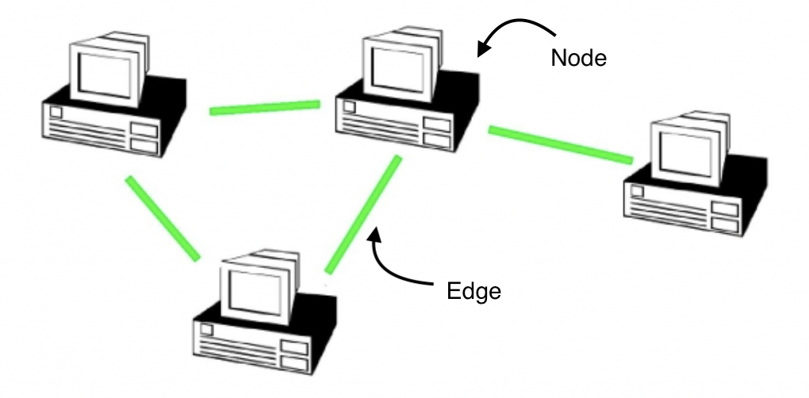

### Graph theory and Network science

Network science and graph are two highly overlapped fields to model and mathematically describe a network, even though two things can be used interchangeably to illustrate a similar idea: the objects(nodes, vertices) are associated by a logical connection(links, edges).(@albertlaszlabarabasi_2016_network) But the nuanced differences between the two statements still exists which can not be interpreted with one. 

Graph theory is a branch of discrete mathematics that provides the fundamental theorem and essential algorithms for the given graph.(@neo4j_2022_graph) The entity of the node and edge object could be a set of objects with different types of items. 

In contrast, network science focus on the observation of real-world representation of the connection to understand the structure and quantify dynamics of the complex system between the objects.(@friedrich_2019_from) For example, society is the linkage of individuals with family, friendships, classmates and coworkers.

#### Internet routing in graph theory

###### _Figure. %&%&%N. Computer routing in graph theory(Source: @albertlaszlabarabasi_2016_network)

The construction of the internet routing network system is valid for an undirected graph as the internet cables provide synchronous communication allowing data upload/download happens simultaneously from both ends.(@gkantsidis_2003_spectral) The system's components in such graph is often called nodes and each direct interaction between two nodes is called edge. 

In a network system, we label a node with $V_i$, where $i$ is the index of the components in the network system, which is labeled as $ i = 1,2,3...n $.

E is a set of edge between the nodes where each edge association is denoted as 
$E_{xy}\rightarrow{((x,y\subseteq V_i) \cap (x\neq y))}$

We denote $K_i$ as the number of edges directly connect to the node $V_i$ in the network, this number is also known as degree. In an undirected network system, the total number of edge $L$ can be calculated by the following equation.
$L=\frac{1}{2}\sum_{i = 1}^N K_i$

#### Attributes in the STC graph
To review the global STCs from multiple aspects of dynamic correlations and bringing quantitative constructions needed for the analysis. The network science and graph theory provides the methods to take into consideration of the quantitative relationship by inserting the numerical values into the nodes and edges within the STC network. The network’s nodes and edges attribute definition are presented in Table %^%^%+1

| Category | Attributes | Relevance |
|---|---|---|
| Node | Label | The name of landing city and country |
| Node | Position | Lon/Lat of of the given node |
| Node | Adjacent | A list of nodes that directly connect by an edge |
| Edge | Label | The name of cable |
| Edge | Connection | Two nodes that construct this relationship |
| Edge | Capacity | The designed maximum data transmission can be carried of the STC per second |
| Edge | Length | The length of the STC between two landing points |
| Edge | Cost | The budget cost when the cable was designed |
| Other | Other | Undirected graph, each node has infinite capacity to route data between two cables |

###### Table. %^%^%N. Network's attribute

#### Keywords/philosophy in the network science

Under such quantitative network, a range of network analysis toolbox offering the analysis approach to measure the topology and properties of the network from multi-dimensional groups of content. 

(@albertlaszlabarabasi_2016_network)(@diestel_2017_graph)(@hoffman_2021_methods)(@muscoloni_2016_richclubness)(@najera_2021_measuring)(@newman_2017_networks)(@saqr_2020_robustness)(@xavier_1998_introduction)

| Concept | Explanation | Application |
|---|---|---|
| Degree | Number of edge connect to a node | To gain a observation of distribution of connection in a network |
| Path | A set of edges that connects from $V_i$ to $V_j$  | A allocate the spatial movement from the origin to destination for given condition |
| Neighbors | There is a node($V_i$) is neighbor of a node($V_j$) such that the edge $E_{V_i,V_j}$ exists. | The diversity of the choice when routing from node to another |
| Connectivity | The measure of the connection between the nodes, there are two or more isolated subgraphs if no path exists between any given two nodes | If the global internet can be access between two countries, either they are connected by STC or the combination of STCs and TTCs |
| Flow | The non-negative capacity associated to each edge | The capability of the data movement that no edge can exceed this limitation |
| Centrality | A measure to the importance of the node in a network | To classify the STC landing points based on their cohesiveness. This allows centrality to be considered as a coefficient to describe node importance |
| Betweenness connectivity | Betweenness centrality measures the number of times a node lies on the shortest path between other nodes. | Provides another view of network elasticity by considering the most influential routing nodes in a network. For example, the transit stop in a connecting flight have have higher betweenness in the flight network  |
| Rich club coefficient | A measure to identify the presence of the connection between well-connected(large number of degree) nodes | The rich club coefficient assess the group robustness and the ability of remain functional when the key group member quit from the collaboration |

###### Table. %^%^%N. Network philosophy and key concepts