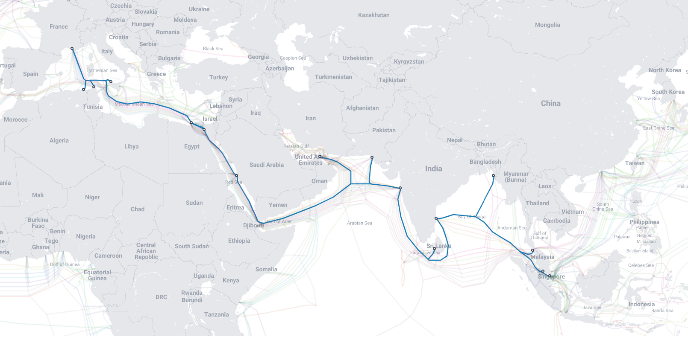
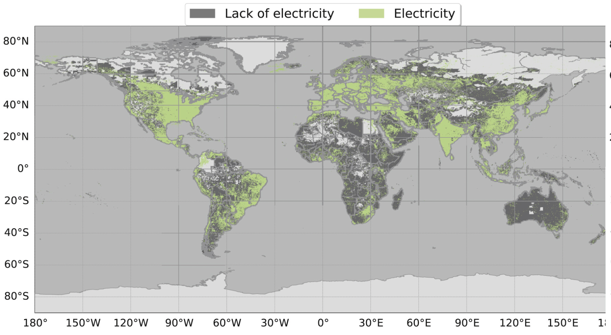

<!-- @import "[TOC]" {cmd="toc" depthFrom=1 depthTo=6 orderedList=false} -->

<!-- code_chunk_output -->

- [Literature Review](#literature-review)
  - [Factors that lead to the STC failure](#factors-that-lead-to-the-stc-failure)
    - [Nature](#nature)
      - [Nature hazard](#nature-hazard)
      - [Animal](#animal)
    - [Human](#human)
      - [Accidental](#accidental)
        - [_Figure. %&%&%N. Impact and drag damage on STC by anchoring(Zheng et al., 2022)_](#_figure-n-impact-and-drag-damage-on-stc-by-anchoringzheng-et-al-2022_)
      - [Intentional](#intentional)
        - [Physical attack](#physical-attack)
        - [_Figure. %&%&%N. Seamewe4(source: @telegeography_2022_submarine)_](#_figure-n-seamewe4source-telegeography_2022_submarine_)
        - [Digital cyber attack](#digital-cyber-attack)
  - [Regulations and international law applied to STC](#regulations-and-international-law-applied-to-stc)
  - [Digital divide](#digital-divide)

<!-- /code_chunk_output -->

## Literature Review

The United Nations Office defines the term Critical infrastructure for Disaster Risk Reduction(USDRR) as _"The physical structures, facilities, networks and other assets which provide services that are essential to the social and economic functioning of a community or society."_(@usdrr_2022_critical) To the importance of the STC, in 1998, US presidential directive PDD-63, also known as Critical infrastructure protection(CIP) aims to protect _"..the assets, systems, and networks, whether physical or virtual, so vital to the United States that their incapacitation or destruction would have a debilitating effect on security, national economic security, national public health or safety, or any combination thereof."_(@mccue_2015_chapter) As the backbone of network communication, STC is ineluctably one of the items within.

In contrast to the importance of the STC in the real world, the research attention on the STC vulnerabilities remains limited. Author adopts three relative fields of literature in this paper: factors that lead to the STC failure, regulations and international law applied to STC, digital divide under STC framework.

### Factors that lead to the STC failure
The current real-world challenges STC facing remains on two perspectives: The first major damage source can be caused by nature hazard or animal incursion; the second category will focus on the human-lead destructions, whether they are accidental or intentional. Protecting the fragile fibre twist pair within the STC is in the top of priority, STC is divided into five different protection classes to overcome the different working conditions and budget balance. (@allawati_2015_balancing)(@ztt_2019_submarine)(@libert_2016_13) 

#### Nature
Considering the cost of assembly and the importance of the network connectivity, the STC is designed to achieve high reliability of 25 years of service life without any maintenance. (@worthington_1984_cable) STCs are laid on the seabed where the depth could reach up to 8000m under the condition of high water pressure, rough rocks combined with marine corrosion to the STC's protective layer.(@laque_1975_marine)(@beaufils_2000_how) Burying into the seabed is the most common way to mitigate the chance of cable failure from external aggressions. 

##### Nature hazard 
During the deployment, the deploy crew will try to avoid seamounts, the exposed cable could be damaged by chafing against the seabed or steep terrain. In additional to that exposed cable are more likely to suffer from the under sea turbulence by over stretching the cable or applying impact force while colliding with the adjacent rocks.(@carter2014submarine) Just like any other terrorerical infrastructure network, earthquakes; volcanic eruptions; landslides are also believed to be the potent nature hazard for STC.(@pope_2017_which) Earthquakes can cause significant movement of the sediments, which might subsequently break off the cable from the landsides on the seabed.(@hughes_2015_effect) Volcanic eruptions produce hot lava flow and steams with the spread of rock fragments which can cause damage on both exposed/unexposed STC in any term(@mcdonald_2017_the). But some believed that volcano eruptions are not the primary cause of the cable breaking, in both Indonesia’s Anak Krakatau volcano in 2018 and Tonga's submarine volcano eruption in 2022, there was a time difference(around an hour) between internet traffic drop and entirely went offline(@Duckett 2022)(@grilli2019modelling) This could potentially means the volcano eruption still remains partially functional working after the largest eruption, revealing the origin of the cable failure comes from other geotectonic movement such as submarine landslide; submarine earthquake or even tsunami(@latter_1981_tsunamis). 

If the cable failure was the result of landslide, the actual repairing crew might suffer from a range of issues from overturning ocean circulation to locating the ends of damaging cables which result in delaying repairing progress. In the case of Tonga 2022, the repair vessel _CS Reliance_ did not prepare enough cable aboard because the broken cables were moved more than 80km due to the landslide or shockwaves. (Needham 2022)

##### Animal
The engineers in the cable design crew are tend to use the cable with stronger armer protection when the STC reaches a very shallowed water zone(less than 50m depth) or the regions makes the cable not suitable to be buried under the seabed, such as rocky outcrops, animal habitats or fishing harbours where intensive external aggression could apply to the STC. Moreover, more than 90% of marine life and erosion of sharp broken rocks by turbulent flow further evaluated the threat on the cables. Majority of the marine animals shows no harm to the STC, but many historical records shows sharks(especially Carcharhinid shark family) are particularly interested to attack STCs this action is also known as sharkbite(@29600) Some research suggested that the visible vibration or acoustic vibration generated by the cable combined with aggressive, curious personality attract the shark's attention from "fish biting".(@eichengreen_2016_cables)(@west2014shark)

#### Human 
The world submarine network did not experience global disruptions thanks to the network rerouting, increasing supply on the cable ships(A specialized ship to install and repair the STC) and fast-growing cable breakdown detection technology in the recent decades.(@inc_2020_submarine) This section will discuss the STC disfunction due to the human activities.

##### Accidental  
There are about 150-200 STC failure cases annually, the marine activities such as fishing dredge and anchoring are the two primary reasons causing the damage on the STC, around 72% of failures were directly made by these. (@Kordahi2016GLOBALTI) Furthermore than that, the failure caused by fishing and anchoring are more likely to happen in the shallow water, the chance decreases as the water gets deeper(@mamatsopoulos_2020_critical) The fishing dredge is towed along the seabed to harvest the species in at the bottom of the ocean, this action can directly cause damage on unburied STC(@carter_2010_submarine) There are two types of damage on STC when anchoring the ship, usually the damage caused by dragging occurs more frequently than impact(@zheng_2022_study)

###### _Figure. %&%&%N. Impact and drag damage on STC by anchoring(Zheng et al., 2022)_

##### Intentional

Considering the role of intelligence in strategic and tactical judgments during armed conflicts, disrupting the source of intelligence links to the outcome of the military operation. (@gentry_2019_intelligence) The first offensive cable cutting can be traced back to WWI, one of first orders after the war declaration between Britain and Germany was to destroy Germany's STC in the English channel, the remaining cables were also under the surveillance of the code breaker team "Room 40" in London(@bruton_2017_the) Resulting of the counterattack of _SMS Emden_(a german navy cruiser) destroyed a British cable landing station at Tabuaeran. (@kennedy_1971_imperial)

The attack of STC includes but not limited to complete break, temporary disabled, interference and disruptions. These faults could cause delay even loss of data packages on a particular cable, even the global capacity overwhelming. (@gentry_2019_intelligence) However, the modern intentional attack still targets two types of vulnerabilities: physical and cyber.

###### Physical attack
Any approach threatening STC caused by the kinetic attack is included in this area. The target facilities could either be on the sea or the cable landing station on the land.
        
- At the sea

Similar to any marine law on the high sea, the lack of information sharing and ability of monitorization on thousands of miles long STC dramatically lower the difficulty when malicious people are trying to attack cables. (@lindsay_2015_the) In addition to that some specialized equipments(e.g. submarines and diving suits) provide more choices to cause the damage. In 2013 Egyptian Navy caught three hackers on a fishing boat near the city of Alexandria who were attempting to cut the SEA-ME-WE 4 cable by utilizing the diving suit, this cable connects from France to Singapore via 16 landing point, which is capable of carrying 2.3Tbit data per second. (@bump_2013_three) 

###### _Figure. %&%&%N. Seamewe4(source: @telegeography_2022_submarine)_

Indeed cutting STC in high sea is a low risk, low investment with enormous achievement on economic sabotage or geopolitical purposes, which dragged the Russian attention to the cables in the transatlantic ocean, especially in North Atlantic.(@hicks_2016_undersea) As one of the world's most cable crowded water, the STC in the north Atlantic is responsible for more than 90% of internet bandwidth between Europe and North America. (@inc_2020_submarine) Recent evidence shows an increasing Russian naval activity was even greater than the Cold war level. (@bbc_2022_russian)(@shalal_2017_russian) Russian have two main weapons threats on the STCs: submarines and surface spy vessels that can deploy remotely operated vehicles(ROV) or crewed submersibles. (@sutton_2021_5) For example, Losharik is a specialized nuclear submarine that can be carried by a larger 'mother' submarine over a long distance. Before its fire accident in 2019, the Losharik could perform topographical research and threaten STC within 1000m below the sea. (@roth_2019_fire) As for the surface vessel, Yantar is the most famous one, a 'special purpose intelligence collection' employed for the Russian Navy, however this title is also seen as a euphemism for a spy ship. Considering, Yantar's deployment and field surveying often near the STCs and occasionally turned off the AIS noted off the attentions from NATO countries. (@sutton_2021_russian)

- Landing point

In contrast with the invisibility of the STC under the water, the on-shore cable landing station are more obverse target. As the terminal of the STCs and the switching site between TTC and STC, CLS are often located in a town away from major cities. (@csric_2016_august) For some budget reasons under the fact of the economy of scale, in many countries, multiple cables are sharing one landing site(@inc_2020_submarine) and the landing site is often less benefitted by the military forces, for example, the CLS in Bude(a town in England) connects 8 STC but the closest tourist trail just 200m away from the main office. (Google map, 2022) This clustering could lead to a greater risk to national security when facing unlawful violence(e.g. terrorists). (@sechrist_2012_new)

- Espionage

Instead of breaking down the network, it is more subtle to utilize the data without being notified. There are three ways for espionage: inserting the backdoor on the cables or other hardware components, targeting the CLS, intercepting the cables at sea. (@morcos_2021_invisible) Each is easier than the one after, the last one is believed to be the most challenging in engineering. (@chirgwin_2014_spies) suggests that placing secret devices by removing protected armour without damaging the high sensitive optic fibre from the high water pressure shock is less likely to happen under the current technology. On the one hand, if the target is the cable located 1000m below the sea, the diver cannot withstand the water pressure and the manipulator arm equipped on submersible are not agile enough to polish and splice the fibre under the dust-free environment. Practically it is much easier(and legally) to tap the data on the landing stations. A document released by the Washington Post(@timberg_2013_nsa) revealed a secret system called "Upstream" from NSA was designed to access communication on fibre cables without damaging the existing connection. As a result, the CLS in Britain and US are the ideal locations to deploy such system since UK is the entry point from the Atlantic and 80% of fibre data flows through the US.(@khazan_2013_none)

###### Digital cyber attack
(@suganami_2017_the) illustrates the concept of viewing data as critical infrastructure in part of the complex global internet supply chain, in the way that identifying the STC in the IoT environment rather than the cable itself. Hackers may remotely control the STC network management system to gain administrative rights, from that point they could identify physical/software vulnerabilities, disrupt the data traffic or create backdoors for further usage. (@morcos_2021_invisible) It is really likely to occur according to (@sechrist_2012_new), most of the firewalls and the secure protection software in most network management systems are not up to date.

At the point of writing, there was no significant global internet failure direct or indirectly caused by STC in the past decades. Even we ignored the fact of the cable failure issued by nature hazards the global STC connectivity still remains fragile from either legal perspective or military interest even terrorist organizations from the perspective of ransoming for EU-US financial market stability.(@clark_2016_undersea)

### Regulations and international law applied to STC

Ban Ki-moon, the former Secretary-General of the United Nations sums up the wisdom in the Oceans and Law of the Sea Report(UN, 2016) _"Submarine cables are a fundamental component of the critical global infrastructure and play a direct role in sustainable industrialization; indirectly they contribute to all other areas recognized as important for sustainable development."_ Just like any diplomatic business, as a transnational communication STC connects multiple countries, even different continents which dramatically complicates the jurisdiction. The attention of international law protection has been extended to the STC, Tallinn Manual - an academic, non-binding study on cyber law written by a group of NATO experts state that _"(STC) generally are treated in the same fashion as cyber infrastructure located on the land territory"_(@schmitt_2017_tallinn). However, the proper legal stand of STC only remains on two international agreements, the 1884 Convention for the Protection of Submarine Telegraph Cables(Cable Convention)(@cableconvention_1884_1884) and 1982 United Nations Convention on the Law of the Sea(UNCLOS)(@un_1982_united). Cable Convention was the result of 20 years of industrial experience of the submarine telegraph cables at that time, which was not the only product of diplomacy but also combined the reflection from the fishery, ocean transportation industry, navy and electrical engineers from 27 countries. Author summarized some key articles from Cable Convention as they are still the foundations of the STC regulations.
1. The convention applies to the cable even it is outside of territorial water.
2. Any intention or culpable negligence break or injury on an STC will be subject to criminal penalties. But it is not applying to the case where captain damaged the cable to save the ship or his passengers.
3. If a cable was broken or injured during the laying or repairing of another cable, the owner of the laying cable shall bear the cost of repairing.
4. The vessel working on the laying or repairing submarine cable shall confirm the signal with the few preventing collisions at sea. Other vessels shall withdraw and keep the distance of one nautical mile, so not to interfere with cable laying or repairing operation. 
5. If a vessel can prove they have sacrificed an anchor, a net, or other fishing gear in order to avoid injury of a submarine cable. The owner of that submarine cable shall pay over these losses.
6. This convention does not apply when a country is in a war.

If Cable Convention only gives some basic guidelines of vessel operation and STC damage compensation, the more recent UNCLOS provides a standard framework of responsibilities, supervision and regulations across the nations. (@carter_2010_submarine) The UNCLOS divides the marine area into five zones(@noaa_2015_noaa). Four primary zones can be identified in terms of STC jurisdiction. (@davenport_2012_submarine) 
1. First zone includes internal water and territorial waters, which marks any water inside of "baseline"(@westington_2002_us) or the sea within 12 nautical miles from the baseline. In this zone, the country has full sovereignty of the STC, laying or repairing cable need to be applied via diplomatic communication channels beforehand. In many countries, the criminalization of espionage in this area is also written in the local law. (@kraska_2015_putting)
2. Next is Contiguous zone, a buffer band within 12-24 nautical miles from the baseline, which aims to prevent the legal issues regarding _"customs, fiscal, immigration or sanitary laws and regulations"_(@pyc_2017_the). However, its functionality is done by the server site where the STC lands or the government cyber security intelligence agency.
3. Following that is the Exclusive Economic Zone(EEZ), which extend up to 200 nautical miles from its baseline. The nation is entitled to develop or harvest any natural resources and establish artificial islands here. (@louisiana_2005_demystifying) However, in article 79, UNCLOS recognizes the right of everyone to laying cables within the EEZ zone(@un_1982_united). Therefore the ownership and the cable destruction responsibility still retains quite vague at this stage.
4. Lastly, any water beyond EEZ and continental shelf are the High Seas, where the domestic law no longer applies. Anyone may lay or repair STC in the high sea, but the damage or injury on other STC still need to face judgement from the international court of justice. (@davenport_2012_submarine)

To improve the existing legal stand of STC, (@rishi_2017_undersea) proposed an assumption by assigning a lead agency to create protection zones in the shallow water where activities likely to damage the STC are prohibited there. Under such framework, a broader maritime planning and better spatial management need to be considered, with the circumstances of increasing gap between the importance of the STC and the amount of legal protection on it. 

### Barriers to connectivity 
Even STC is a world spread infrastructure, there are still 2.9 billion people who do not have access to the internet, especially in developing countries where the people are not covered by 2G or 3G signal.(@itu_2021_29) At the regional level, users in Africa are paying 3 times the global median price on the broadband services fee for a similar level of services stand. (@itu_2022_global)

#### Lack of infrastructure
Accessibility to the internet has closed roll-out with infrastructure, Most ISPs do not deploy infrastructures in areas with less commercial prosperity. Although constructing new infrastructure is usually associated with coverage, barriers such as the lack of electricity, lack of road(harbour) access, and underdevelopment of domestic backbone networks. These observations are particularly prevalent in the rural areas and low-income regions, the challenge in terrain; higher deployment costs and government corruption give a longer cost recovery period. (@chen2004global)
The stable supply of electricity is the essential prerequisite for any internet connectivity, to sustain the functional working of both landing stations and sub-base stations. Fig shows a map indicating the lack of electrical infrastructure around the world, the lack of electricity is particularly serious is Africa. The region is also known for its poverty(@worldbank_2011_poverty) and more than half of the population does not have access to electricity(@worldbank_2018_access). 

###### _Figure. %&%&%N. Electricity infrastructure distribution(source: @DELPORTILLO2021102092)_

#### Affordability 
Internet affordability can still be a barrier even if the electricity infrastructure is in place. By estimate there are still around 10% of individuals do not have the access to the internet. (@johnson_2022_internet) People's disposable income and internet data package subscription fees are the two major barriers to utilising broadband services. Broadly speaking, the device cost has always been the most significant issue for low-income groups, but recently the intensive price competition between terminal device brands and a well-established hardware reuse chain has dramatically reduced the price barrier. The monthly data package services becomes a luxury, especially in the COVID-19 era, the ratio between fixed broadband services plays a bigger segment in people's gross national income(GNI) which climbed from 2.9% in 2020 to 3.5% in 2021. (@itu_2022_global) The ITU is aiming for more affordable broadband services to everyone with less than 2% of GNI by 2025. (@itu_2021_affordability)

#### Extend connectivity

However, satellite internet can be an alternative technology to replace the STC by using non-synchronous orbit satellites. (@graydon_2019_connecting) These satellites rotate around the earth obit, providing wireless internet connection to the customer near the earth's surface. If the satellite is located in geostationary earth orbit, the user will suffer from high latency and limited bandwidth. Low Earth orbit (LEO) satellites can significantly mitigate these issues. Still, LEO acquires hundreds of thousands of satellites to provide worldwide coverage which gives higher standards to the internet services provider(ISP). (@deutschmann_2021_broadband) Regardless, LEO has always been the most commercially successful satellite internet service and also gains extra technical standpoint during the manufacturing processes, which resulting a higher standard on user budget than STC, as more professional technical devices and expensive data packages need to be pre-purchased before usage. (@DELPORTILLO2019123) On the other hand, if the service area is retained in 100-10000$km^2$ on a small number of base stations is required to achieve suboptimal working conditions with minimal maintenance(@djuknic1997establishing). This makes the LEOs particularly useful from facilitating the telecommunication infrastructure damage recovery(@alnajjar2014low) to permanent communication infrastructure in rural areas(@bleicher20185g)