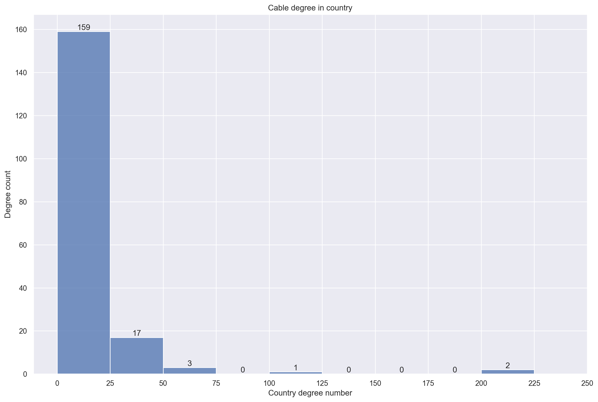

# Results

## Country \Ignore TOC
* Country description
    * Map of first constructed cable
    * map of connection
    * hist of the number of connected node
* Bandwidth shortage
    * predict bandwidth
    * horizontal bar
* Cable redundancy
    * perc of functional STC -> hbar
    * STC robust country -> Waffle
    * STC vulnerable countries -> ring

## Landing station \Ignore TOC
* Network Analysis
    * Policy-Based Routing -> routing options
        * pre: Why we use shortest path? Yeman-India 
        * distance
        * cost
        * budget
        * bandwidth
        * Overlap
        * Description compare
    * Physical failure on landing stations and undersea cable
        * Degree count
            * heat map
        * degree centrality
            * centrality map
            * city rank(with belonging country)
        * betweenness centrality
            * betweenness centrality maps
            * overlap
* Network optimization -> tonga area
    * before optimization
    * after optimization
        * argue building more cables with star-link
            Tonga fixed line price: https://tech.pngfacts.com/2019/01/cost-of-internet-services-in-tonga.html
            starlink price:https://www.cnet.com/news/starlink-satellite-internet-explained/
    * rich-club

## Results

In this section, author presents the results of the STC network vulnerability in two levels where their topologies are not prespecified. 

The analysis start off with a generalized country level STC network connection, focusing on the shortage of the STC due to the nature growth in the international internet bandwidth and the country's internet robustness when multiple STC failure happens simultaneously. To better understand internet accessability, author obtains a detailed route level network for the STC paths to analysis of 4 tests of edge distance measures with 3 node degree assessment to this analysis.

### Study scope
As a marine based infrastructure, STC is not suitable and applicable to be deployed in all the countries. Snce the fist STC was laid in 1989 the global internet network interconnects almost all the countries in the world with 183 countries owns at least one STC cable. Countries left out were either territorially landlocked(eg. Mongolia and Ethiopia) or geopolitically less interest to it(eg. North korea). 

###### _Figure. %&%&%N. Map of first STC cable laying year_

### High(country) level STC

#### Distribution of STC between countries
The high level data aggregate the STC information into the country level, which includes the mainland; dependent areas and overseas territories.(Nationsonline, 2022) This makes some small oversea island be in part of its geographic territories, for example Guam is an unincorporated territory of the US in western pacific Ocean(US. DOI, 2016) but it is responsible for 7 out of 20 STCs connection between East Asia and West America(TeleGeography, 2022). This leaves 396 edges connections across 183 countries.

###### _Figure. %&%&%N. Country level connection_

The Figure %&%&%& presents the visualization of the country level STC connection, where each node is the representation of one country and there is at least one edge directly connect to it. The edge width is proportional to the count of STCs in charge of the end-to-end connection between two nodes.

###### _Figure. %&%&%. Country degree in histogram_

Combined to that, the distribution of this result shows a high clustering of the domestic connection in south east asia and europe. As the majority of the countries are having less than 25 direct STC connection to other states, in this case the design of STC tend to build a loosen and distributed network in a small area. This network has the edge density = 1/17, this ratio indicates the gap between actual edge and the max possible edge.

#### Bandwidth shortage due to the nature growth

Despite the development of the local cashing services(eg. CDN) over last two decades, increased investments in STC by the tech giants and continued construction of data centers around the globe, the demand on the international bandwidth seem to increase in the next few year according to the estimation and statistics from ITU(ITU, 2022). 

###### _Figure. %&%&%N. Country most vulnerable to international bandwidth shortage_

Figure %&%&%& shows the top 10 countries who have the risk to overcome the gap between the amount of international bandwidth provided by the STC and increasing internet services demand from its people even the new STCs are finishing the deployment as they were planed. Eventhough Poland, Romania, Croatia are most vulnerable to this situation, in reality as members of the Europe union the actual damage is less than the paper result as the bandwidth deficit can be covered by TTC from adjacent countries. In contrast, countries with less political stability(eg. Syria) and geographically located in an island(eg. Vanuatu) will suffer more on this, especially during the internet rush hours. 

#### STC redundancy analysis

With over 100 yearly accident from human unintentional incident(eg. fishing dredge and anchoring) to nature hazard combined with the potential hostile attack for military purposes. (Mauldin, 2017) It is not hard to imagine the scenario where a country's internet services are disrupted by multiple cables losses at the same time. To simulate the consequences of such disruption in the worst case scenario, the strength of the internet is examined by assessing the remaining bandwidth after removing the cables with highest bandwidth. 

###### _Figure. %&%&%N. STC country bandwidth robustness compare_

Firstly, the countries with less than 3 redundant cables are considered as vulnerable to the internet connection. It is rare case for a county to have simultaneous STC failure on 3 cables, it is advantageous if the country could still make essential communication with outside world under such scenario. Figure %&%&%& lists the share of countries based on their redundancy status. The STC vulnerable countries can not obtain the STC connectivity, which could critical for some island country or territories as the lack of the TTC means potentially loss 100% of the international bandwidth. 

###### _Figure. %&%&%N. Spatial distribution of STC vulnerable countries_

To further investigate the STC robustness, Figure %&%&%& shows the spatial distribution of the STC vulnerable countries in a detailed result in Figure %&%&%&-1. The outer ring is the share of total bandwidth from each continents where as the inner ring gives the portion for every county. Continents with high percentage are Asia > Africa > North America > Oceania > South America > Europe. According to the figure, Although Asia is the most vulnerable continent as it gives the highest figure, it is made up by a handful countries with high bandwidth. In contrast to North America and Africa, a smaller sector from each country with a high number country count. As a case concerns the South America, which only consists 3 vulnerable countries: French Guiana, Guyana and Suriname with a evenly distributed bandwidth allocation. Each country deliver a summed weight capacity and cable count of 209.65Tb/s and 2.67cables/country. 

###### _Figure. %&%&%N. Scenarios of STC failures with most robust countries_

###### _Figure. %&%&%N. Scenarios of STC failures with lest robust countries_

There are 94 countries assigned to STC robust group, as each country can withstand the three or more losses on STC. As the result of cable failure, the country may suffer from a reduction on the international bandwidth capacity. However, losing one or two cables is more likely to happen in the real world. Figure %&%&%& and %&%&%&-1 shows the resultant remaining bandwidth in percentage to retain the internet connectivity if the top three widest cable fails. 

The USA is the leading in the remaining bandwidth after the multiple cable failure, thanks to its excellent distribution and availability of redundant cables. With cable edge $K_{usa}=29$ and estimated potential bandwidth of 1479.76Tb/s. After the connection loss of its widest cable Dunant, a reduction of 250Tb/s(16.89%) in the overall US bandwidth can be expected. Even in the worst case scenario in this study where top3 cables are failing at the same time, USA would still obtains remaining international bandwidth capacity of 642.43Tb/s. This number is still higher than the actual demand.(41.16Tb/s in 2022)(ITU, 2022) Besides than that, the continental USA is geographically adjacent to Canada and Mexico which can provide additional TTC bandwidth capacity if necessary.

In contrast the cable design in Isle of Man is fairly unbalanced as the result of disconnect in its widest cable Havhingsten/CeltixConnect-2, it would expect loss 98.66% of bandwidth, with remaining 1.42Tb/s potential capacity from the rest of 3 cables.

### Low(landing station) level STC
To better understand how STC distributed across the world, author also concerns a detailed low-level route for the STC paths. The figure below outline the landing stations and the geographical path of the global STC connection. Table %^%^%+1 provides summarizing the quantitative data from the dataset.

###### _Figure. %&%&%N. STC network in landing station level_

From the Table %^%^%+1 we can observe a highly skewed data distribution as the mean values are closed to 75% with a rapid increase in cable capacity, cable length, cable cost after that. 

| |country|landing station| cable capacity(Tb/s) | cable length(KM) | cable cost(million USD)|
|---|---|---|---|---|---|
|count |183.00|1335.00| 501.00 | 501.00 | 501.00|
|mean ||| 50.42 | 3406.04 | 119.61|
|std ||| 231.24 | 5986.72 | 182.44|
|min ||| 0.00 | 5.00 | 0.25|
|25% ||| 0.25 | 225.00 | 15.00|
|50% ||| 5.91 | 775.00 | 40.10|
|75% ||| 44.38 | 3472.00 | 122.00|
|max ||| 4000.00 | 45000.00 | 1007.78|
###### _Table. %^%^%N Summary for low level STC data_

Meanwhile, it is interesting to compare Table %^%^%^ and Figure %&%&%+1, while countries such as Indonesia(138), United States(126), United Kingdom(88) are way outnumbered than rest of 180 countries accounting 26% of global landing station count. Such such, these countries are tend to have more redundancy cables than the rest of the world. 

###### _Figure. %&%&%N. STC network in landing station level_

#### Policy-Based Routing
Consider the nature of routing in a complex network, path from source node to destination can be selected from a vast options. Figure %&%&%&+1 shows an case of data communication between Yemen-India via STC. Although there are only six routes on the mao, there are many alternative routes with longer distance and bypassing more landing stations can be discovered. 

###### _Figure. %&%&%N. STC route options from Yemen-India_

To approach the network routing while selecting the best route a range of information need to be considered.(Baumann et al., 2007) In this case, author compare the routes from Bude(UK) to Shanghai(China) to identify the shortest path under different use case of the data transmission.

###### _Figure. %&%&%N. Low-level shortest-path route ($C^S$)_

###### _Figure. %&%&%N. Low-level shortest-path route ($C^L$)_

###### _Figure. %&%&%N. Low-level shortest-path route ($C^B$)_

###### _Figure. %&%&%N. Low-level shortest-path route ($C^C$)_

As the Figure %&%&%&-3 to %&%&%& shown, data packages choose a different path based on their routing policy, in such instance, $C^B$ choose a geographically longer route to exchange for a higher bandwidth capacity in comparison to other routes. Using Mumbai(India) as the routing transit station is the common practice in this study case, the importance of Mumbai in global STC connection will be presented later. It is also interesting to see a high overlap between the STC route and some of the most important shipping trade routes, take $C^S$ as an example, the route passes English Channel, Strait of Gibraltar, Suez canal, Bab al-Mandab Strait, Malacca Strait before it reaches its destination. It is risky for the cables by damaging from the anchors, as a large number of ships are right above the STC cables in the shipping route area. In addition to that cable density in these regions are usually higher than normal due to the narrow width alone the bank(205m for Suez canal) the damage from natural hazard or explosions may cause failure on multiple STCs.

#### Physical failure on landing stations and undersea cable(Analysis from centralities)(Degree centralities)

To assess the importance of each individual landing station, the degree centrality provides a quantitative measure to classify the nodes based on their cohesiveness. Accordingly, the count of adjacent edges for each landing station will be assessed. Figure %&%&%&+1 captures the results of the degree centrality based on the landing stations. Mumbai(India) is the headmost with 160 connections and 0.43 degree centrality, followed by Shima(Japan) and Jeddah(Saudi Arabia), their high values can be explained by the geographic location as the transit countries. Japan is the gateway to connect Asia and Pacific ocean, similarly Saudi Arabia is located near the Suez Canal the shortest sea connection between Asia and Europe. Other side of the coin, the landing stations with the lowest can be found in the island countries or regions with only one cable connect to it eg. Aeng Batu Batu(Indonesia), Balluta Bay(Malta)

###### _Figure. %&%&%N. Low-level degree centrality map_

The landing stations with a high degree centrality are more significant in the STC network locally, arguably, such design is not ideal in terms of risk assessment. The high degree centrality node consists of a intenser connection, the failure in the node itself cause by unexpected accidents (eg. power blackout, riots, terrorist attack) would cause more serious damage to the communication globally as the data routing can not proceed to the succeeding landing station. Besides the landing stations mentioned above, Singapore is also extremely valuable factor to the STC network but directly be observed from the map. Due to the limited area in Singapore, the two landing stations(Changi North and Tuas) are only 35km apart and the accident in one landing station is likely to implicate another.

#### Betweenness centrality

To account for breakage risk of cable topology in the sea, one important issue that needs to be considered is the geographical distribution of the cable laying on the most optimal path. The betweenness centrality returns the ratio which the node is sitting alone the shortest path between any two nodes, it can be seem as a comprehensive measure of the routing path selection in terms of the possibilities. With different focus of the data routing policies, Figure %&%&%&+1 visualize the distribution of the betweenness centrality individually while the Table %^%^% +1 statistically summarize the value.

###### _Figure. %&%&%N. Betweenness centrality Overview_

###### _Figure. %&%&%N. Betweenness centrality Zoomed_

||Latency|Cost|Capacity|
|---|---|---|---|
|count|7229|7229|7229|
|mean|0.015085355|0.016789418|0.019458784|
|std|0.043984581|0.051353499|0.064554104|
|min|0|0|0|
|25%|0.000892193|0.000609267|0.000675097|
|50%|0.002603469|0.002106302|0.002119711|
|75%|0.008613072|0.009043768|0.007870817|
|max|0.371998844|0.48875602|0.517119399|
###### _Table. %^%^%N Summary of low-level betweenness centrality_

The betweenness centrality distribution for each routing policy gives a power law distribution pattern in Figure %&%&%&-1 while Table %^%^%^ contains the relevant summary statistics. This is a bad design in the network science, where the route choice is heavily dependent on the handful nodes to maintain its performance. If the failure happens on the high betweenness centrality nodes failed, this design would result in a dramatically deteriorate the efficiency of the data flow when the network is switched to the sub-optimal route(eg. takes more time to the destination, narrowed bandwidth, higher usage cost). As the result of more detailed data pattern across different routing policies, Figure %&%&%& gives a zoomed view of fist 500 nodes from the Figure %&%&%&-1. It is evident that Bandwidth > Cost > Latency in first 300 nodes, which mostly explains the big difference in the mean value with little variation in 75% values from Table %^%^%^. 

Therefore, a higher reduction on global STC bandwidth than the latency can be expected if any highlighted node/cable broken down in the Figure %&%&%&+1 to Figure %&%&%&+3. Furthermore, the latency betweenness centrality distribution gives a shallowed curve and lower standard deviation which speaks to a more distributed network with higher resilience than other routing policies.

###### _Figure. %&%&%N. Low-level Betweenness centrality map($C^L$)_

###### _Figure. %&%&%N. Betweenness centrality map($C^B$)_

###### _Figure. %&%&%N. Betweenness centrality map($C^C$)_

Figure %&%&%&+1 aggregates the betweenness results above to provide an summary of the nodes distribution to the adjacent cables. 

Latency focus: One cable to connect different continents
Cost focus: Widely spread, 
Bandwidth focus: One major cable, assist by many sub cables

###### _Figure. %&%&%N. Aggregated betweenness centrality map_
