<!-- @import "[TOC]" {cmd="toc" depthFrom=1 depthTo=6 orderedList=false} -->

<!-- code_chunk_output -->

- [Abstract](#abstract)
- [Keywords/Jargons](#keywordsjargons)
- [Introduction](#introduction)
- [Literature Review](#literature-review)
  - [Technical factors that lead to the STC failure](#technical-factors-that-lead-to-the-stc-failure)
        - [_Figure. %&%&%N. Impact and drag damage on STC by anchoring(@zheng_2022_study)_](#_figure-n-impact-and-drag-damage-on-stc-by-anchoringzheng_2022_study_)
  - [Regulations and international law applied to STC](#regulations-and-international-law-applied-to-stc)
  - [Destruction and espionage](#destruction-and-espionage)
    - [Physical attack](#physical-attack)
        - [_Figure. %&%&%N. Seamewe4(source: @telegeography_2022_submarine)_](#_figure-n-seamewe4source-telegeography_2022_submarine_)
    - [Digital cyber attack](#digital-cyber-attack)
- [Data](#data)
  - [Dataset gathering](#dataset-gathering)
    - [Submarine cable dataset](#submarine-cable-dataset)
    - [Global bandwidth dataset](#global-bandwidth-dataset)
  - [Dataset pre-process](#dataset-pre-process)
  - [Dataset Storage](#dataset-storage)
  - [Data category](#data-category)
    - [High level data description](#high-level-data-description)
    - [Low level data description](#low-level-data-description)
- [Method](#method)
  - [Graph theory and Network science](#graph-theory-and-network-science)
    - [Internet routing in graph theory](#internet-routing-in-graph-theory)
        - [_Figure. %&%&%N. Computer routing in graph theory(Source: @albertlaszlabarabasi_2016_network)](#_figure-n-computer-routing-in-graph-theorysource-albertlaszlabarabasi_2016_network)
    - [Attributes in the STC graph](#attributes-in-the-stc-graph)
        - [Table. %^%^%N. Network's attribute](#table-n-networks-attribute)
    - [Keywords/philosophy in the network science](#keywordsphilosophy-in-the-network-science)
        - [Table. %^%^%N. Network philosophy and key concepts](#table-n-network-philosophy-and-key-concepts)
  - [Bandwidth shortage](#bandwidth-shortage)
  - [Policy-Based Routing](#policy-based-routing)
        - [Table. %^%^%N. Edge properties](#table-n-edge-properties)
  - [Network Analysis](#network-analysis)
        - [Table. %^%^%N. Network analysis compare](#table-n-network-analysis-compare)
  - [Network optimization](#network-optimization)
        - [Pseudocode of Chinese postman problem(Source: @tum_2015_the)](#pseudocode-of-chinese-postman-problemsource-tum_2015_the)
- [Results](#results)
  - [Study scope](#study-scope)
        - [_Figure. %&%&%N. Map of first STC cable laying year_](#_figure-n-map-of-first-stc-cable-laying-year_)
  - [High(country) level STC](#highcountry-level-stc)
    - [Distribution of STC between countries](#distribution-of-stc-between-countries)
        - [_Figure. %&%&%N. Country level connection_](#_figure-n-country-level-connection_)
        - [_Figure. %&%&%. Country degree in histogram_](#_figure-country-degree-in-histogram_)
    - [Bandwidth shortage due to the nature growth](#bandwidth-shortage-due-to-the-nature-growth)
        - [_Figure. %&%&%N. Country most vulnerable to international bandwidth shortage_](#_figure-n-country-most-vulnerable-to-international-bandwidth-shortage_)
    - [STC redundancy analysis](#stc-redundancy-analysis)
        - [_Figure. %&%&%N. STC country bandwidth robustness compare_](#_figure-n-stc-country-bandwidth-robustness-compare_)
        - [_Figure. %&%&%N. Spatial distribution of STC vulnerable countries_](#_figure-n-spatial-distribution-of-stc-vulnerable-countries_)
        - [_Figure. %&%&%N. Scenarios of STC failures with most robust countries_](#_figure-n-scenarios-of-stc-failures-with-most-robust-countries_)
        - [_Figure. %&%&%N. Scenarios of STC failures with lest robust countries_](#_figure-n-scenarios-of-stc-failures-with-lest-robust-countries_)
  - [Low(landing station) level STC](#lowlanding-station-level-stc)
        - [_Figure. %&%&%N. STC network in landing station level_](#_figure-n-stc-network-in-landing-station-level_)
        - [_Table. %^%^%N Summary for low level STC data_](#_table-n-summary-for-low-level-stc-data_)
    - [Policy-Based Routing](#policy-based-routing-1)
        - [_Figure. %&%&%N. STC route options from Yemen-India_](#_figure-n-stc-route-options-from-yemen-india_)
        - [_Figure. %&%&%N. Low-level shortest-path route ($C^S$)_](#_figure-n-low-level-shortest-path-route-cs_)
        - [_Figure. %&%&%N. Low-level shortest-path route ($C^L$)_](#_figure-n-low-level-shortest-path-route-cl_)
        - [_Figure. %&%&%N. Low-level shortest-path route ($C^B$)_](#_figure-n-low-level-shortest-path-route-cb_)
        - [_Figure. %&%&%N. Low-level shortest-path route ($C^C$)_](#_figure-n-low-level-shortest-path-route-cc_)
    - [Degree centralities](#degree-centralities)
        - [_Figure. %&%&%N. Low-level degree centrality map_](#_figure-n-low-level-degree-centrality-map_)
    - [Betweenness centrality](#betweenness-centrality)
        - [_Figure. %&%&%N. Betweenness centrality Overview_](#_figure-n-betweenness-centrality-overview_)
        - [_Figure. %&%&%N. Betweenness centrality Zoomed_](#_figure-n-betweenness-centrality-zoomed_)
        - [_Table. %^%^%N Summary of low-level betweenness centrality_](#_table-n-summary-of-low-level-betweenness-centrality_)
        - [_Figure. %&%&%N. Low-level Betweenness centrality map($C^L$)_](#_figure-n-low-level-betweenness-centrality-mapcl_)
        - [_Figure. %&%&%N. Betweenness centrality map($C^B$)_](#_figure-n-betweenness-centrality-mapcb_)
        - [_Figure. %&%&%N. Betweenness centrality map($C^C$)_](#_figure-n-betweenness-centrality-mapcc_)
        - [_Figure. %&%&%N. Aggregated betweenness centrality map_](#_figure-n-aggregated-betweenness-centrality-map_)
  - [Network optimization](#network-optimization-1)
        - [_Figure. %&%&%N. Tonga internet traffic during the STC failure_(@cloudflare_2022_internet)](#_figure-n-tonga-internet-traffic-during-the-stc-failure_cloudflare_2022_internet)
    - [Redundancy analysis](#redundancy-analysis)
        - [_Figure. %&%&%N. Planned STC optimization for Tonga_](#_figure-n-planned-stc-optimization-for-tonga_)
        - [_Figure. %&%&%N. Rich-club analysis in Tonga_](#_figure-n-rich-club-analysis-in-tonga_)
    - [Financial cost](#financial-cost)
        - [_Figure. %&%&%N. Estimate cost to deploy redundant cables_](#_figure-n-estimate-cost-to-deploy-redundant-cables_)
        - [_Figure. %&%&%N. Cost of new STC compare with alternative technology_](#_figure-n-cost-of-new-stc-compare-with-alternative-technology_)
- [Discussion](#discussion)
- [Conclusion](#conclusion)

<!-- /code_chunk_output -->


## Abstract
With the rise of global internet connectivity and the increasing availability of inexpensive computer devices. The submarine telecommunication cable(STC) plays as the backbone infrastructure to carry the data traffic in the international information transmission. However, STC is extremely vulnerable to damages such as natural disasters and terrorist attacks. If the damage is taken, the repairing may need a few months before the finish and this would directly cause the bandwidth detrition or lagging to the internet services. To understand this question, this article models the global STC under a topological network structure to identify the high risk area. As the result, 88 STC vulnerable countries and an uneven distribution of network dependency can be located. For a given STC topology, we proposed a method to improve and analysis its topological robustness. These findings may provide some inspiration to the industry and politicians to revisit the importance and current protection measurements on the STC system.

## Keywords/Jargons
STC: Submarine telecommunication cable
TTC: Terrestrial telecommunication cable
CDN: Content delivery network
Bandwidth: The maximum amount of data transmitted over an internet connection in a given amount of time
Routing: A process of path selection while transferring data across multiple network systems.
Capacity: Default refers to Potential capacity, the total amount of design capacity that installed all available equipment at the ends of the cable.
Lit capacity: The amount of capacity that is actually running over a cable.

## Introduction
As the progress of the information technology on mobile devices combined with the rise of the 5G technology and cloud computing services, the demand for the higher stand internet services can be foreseen. The world needs a medium to transmit big amount of data inexpensively more than ever. As the "high way" of data communication, the optic fibre is the most common tool for wired long-distance data communication.(@kangovi_2017_3) There are two types of state level fiber optic cables: fibre optic terrestrial telecommunication cable(TTC) and fibre optic submarine telecommunication cable(STC). In terms of useability, the latter gains a bigger market share. (@marra_2018_ultrastable) Nowadays, STC is responsible for more than 98% of global internet transmission (@winseck_2017_the). By estimate, more than 1.2 million KM of STC were constructed. (Wang et al., 2019). In some terms, any internet service depends on STC's functional working in fields like academia, education, entertainment, finance, medication, and the military. Considering the irreplaceability of STC in all aspects of people's daily life, the failure could cause a significant negative impact on the social and economic disruptions on a community or society. 

The failure of an STC might not give inaccessibility of the worldwide internet, as the nature of the internet routing topology, (@calvert_1997_modeling) suggested that the connection can still be obtained by a longer and less stable connection. (@turner_2010_california). However, it is not true for all the countries. In 2008 a dragging ship anchor damaged either SEA-ME-WE 4 or FLAG, the internet automatically rerouted the data to SEA-ME-WE 3 and overwhelmed its design capacity, which subsequently caused more than 50% of internet services interruption in middle-east area. (@zetter_2008_undersea) More recently, in 2022 the volcano eruption in Tonga caused the failure to Tonga's only STC, which caused the nation to lose almost all communication with the rest of the world for five weeks.(@bateman_2022_cut) Due to the commercial interest and limited internet usage, usually less developed countries and remote islands such as Chile or Marshall island do not have an alternative STC for redundancy. (@domineyhowes_2022_when) Obversely these countries are more dependent and suffer more losses if the STC breaks down. 
    
Even STC is a world spread infrastructure, there are still four billion people who do not have access to the internet. However, satellite internet can be an alternative technology to replace the STC by using the non-synchronous orbit satellites. (@graydon_2019_connecting) These satellites rotate around the earth obit, providing wireless internet connection to the customer near the earth's surface. If the satellite is located in geostationary earth orbit, the user will suffer from the high latency and limited bandwidth, whereas the low Earth orbit (LEO) satellites can significantly mitigate these issues, but LEO acquires hundreds of thousands of satellites to provide worldwide coverage which gives higher standards on the internet services provider(ISP). (@deutschmann_2021_broadband) Regardless, satellite internet services always have higher requirements on the user budget than STC, as the professional technical devices and expensive data packages need to be pre-purchased before usage. (@starlink_2022_starlink)

## Literature Review

The United Nations Office defines the term Critical infrastructure for Disaster Risk Reduction(USDRR) as _"The physical structures, facilities, networks and other assets which provide services that are essential to the social and economic functioning of a community or society."_(@usdrr_2022_critical) To the importance of the STC, in 1998, US presidential directive PDD-63, also known as Critical infrastructure protection(CIP) aims to protect _"..the assets, systems, and networks, whether physical or virtual, so vital to the United States that their incapacitation or destruction would have a debilitating effect on security, national economic security, national public health or safety, or any combination thereof."_(@mccue_2015_chapter) As the backbone of network communication, STC is ineluctably one of the items within.

In contrast to the importance of the STC in the real world, the research attention on the STC vulnerabilities remains limited. Author adopts three relative fields of literature in this paper: technical factors that lead to the STC failure, regulations and international law applied to STC, human destruction and espionage.

### Technical factors that lead to the STC failure
To identify the real-world challenges STC face, some intersected content between this section and "destruction and espionage". Nevertheless, this section focus on accidental human damages and the damages caused by natural disaster.

Considering the cost of assembly and the importance of the network connectivity, the STC is designed to achieve high reliability of 25 years of service life without any maintenance. (@worthington_1984_cable) STCs are laid on the seabed where the depth could reach up to 8000m under the condition of high water pressure, rough rocks combined with marine corrosion to the STC's protective layer.(@laque_1975_marine)(@beaufils_2000_how) 

To protect the fragile fibre twist pair within the STC, STC is installed with five different protection classes to overcome the different working conditions and budget balance. (@allawati_2015_balancing)(@ztt_2019_submarine)(@libert_2016_13)

* Light Weight(LW):
This cable is the basic unit of the STC equipped with the minimum protection, which is only designed with a stainless steel tube with fibres and a layer of polyethylene extrusion(PE) outside for protection. It is only used for a depth of 8km below the sea because very few human interferences and potential animal damage could reach such depth. 

* Light Weight Protected(LWP):
During the deployment, the deploy crew will try to avoid seamounts, seamounts could cause the cable to chafe against the seabed. However, steep terrain can not be avoided in some regions due to the congestion or budget on the cable length. In addition to LW, LWP provides extra protection with a layer of steel tape and insulation which is more robust to resist to abrasion LW before failure. Another reason why engineer uses LWP is the shark, some research suggested that the visible vibration or acoustic vibration generated by the cable attracts the shark's attention from "fish biting".(@eichengreen_2016_cables)

* Single Armor(SA): 
SA equips a 3 to 3.5mm diameter of single layer of high strength galvanized armour outside of the LW. It can be deployed to 2000m depth which is also the maximum depth for fishing equipment. Burying into the seabed is required to prevent external damage from human activity or other fish from biting.

* Double Armor (DA):
In addition to SA, DA is protected by a second layer of high strength galvanized armour which makes the cable stiffer to the damage. The DA is suitable for shallow water within 500m depth where the region can not be buried under the seabed, such as rocky outcrops, animal habitats or fishing harbours. In some places, DA is also the alternative solution to the SA due to the harsh environmental conditions or the cost of burying. 

* Rock Armor (RA):
RA should be used when the STC reaches a very shallowed water zone(less than 50m depth) or near the coastline where intensive external aggression could apply to the STC. Moreover, more than 90% of marine life lives in the photic zone(Peck, 2018) and the erosion of sharp broken rocks by turbulent flow(@liu_2015_experimental) are on the same layer of the ocean with RA.


The world submarine network did not experience global disruptions thanks to the network rerouting, increasing supply on the cable ships(A specialized ship to install and repair the STC) and fast-growing cable breakdown detection technology in the recent decades(@inc_2020_submarine)

There are about 150-200 STC failure cases annually, the marine activities such as fishing dredge and anchoring are the two primary reasons for causing the damage on the STC, around 72% of failures were directly made by these. (@kordahi_2016_global) Furthermore than that, the failure caused by fishing and anchoring are more likely to happen in the shallow water, the chance decreases as the water gets deeper(@mamatsopoulos_2020_critical) The fishing dredge is towed along the seabed to harvest the species in at the bottom of the ocean, this action can directly cause damage on unburied STC(@carter_2010_submarine) There are two types of damage on STC when anchoring, usually the damage caused by dragging occurs more frequently than impact(@zheng_2022_study)

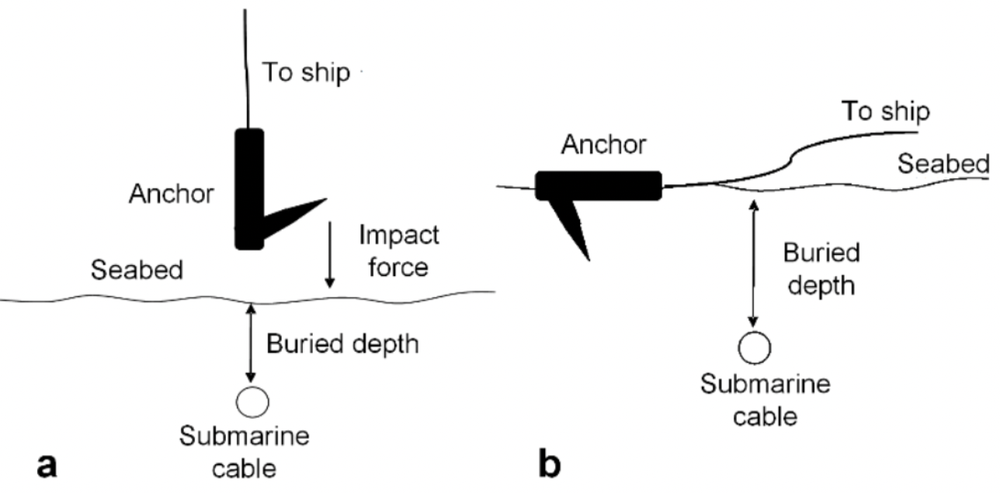
###### _Figure. %&%&%N. Impact and drag damage on STC by anchoring(@zheng_2022_study)_

Earthquakes, volcanic eruptions, tsunamis and submarine landslides are believed to be the potent non-human hazard for STC(@pope_2017_which). Earthquakes can cause significant movement of the sediments, which subsequently triggers the landsides on the seabed. Volcanic eruptions damage the STC by lava flow and hot rock fragments(@mcdonald_2017_the). In some cases, the volcano eruption is the origin of the tsunami and submarine earthquake(@latter_1981_tsunamis), which further increased the chance of STC failure.

### Regulations and international law applied to STC

Ban Ki-moon, the former Secretary-General of the United Nations sums up the wisdom in the Oceans and Law of the Sea Report(@un_2016_submarine) _"Submarine cables are a fundamental component of the critical global infrastructure and play a direct role in sustainable industrialization; indirectly they contribute to all other areas recognized as important for sustainable development."_ Just like any diplomatic business, as a transnational communication STC connects multiple countries, even different continents which dramatically complicates the jurisdiction. The attention of international law protection has been extended to the STC, Tallinn Manual - an academic, non-binding study on cyber law written by a group of NATO experts state that _"(STC) generally are treated in the same fashion as cyber infrastructure located on the land territory"_(@schmitt_2017_tallinn). However, the proper legal stand of STC only remains on two international agreements, the 1884 Convention for the Protection of Submarine Telegraph Cables(Cable Convention)(@cableconvention_1884_1884) and 1982 United Nations Convention on the Law of the Sea(UNCLOS)(@un_1982_united). Cable Convention was the result of 20 years of industrial experience of the submarine telegraph cables at that time, which was not the only product of diplomacy but also combined the reflection from the fishery, ocean transportation industry, navy and electrical engineers from 27 countries. Author summarized some key articles from Cable Convention as they are still the foundations of the STC regulations.
1. The convention applies to the cable even it is outside of territorial water.
2. Any intention or culpable negligence break or injury on an STC will be subject to criminal penalties. But it is not applying to the case where captain damaged the cable to save the ship or his passengers.
3. If a cable was broken or injured during the laying or repairing of another cable, the owner of the laying cable shall bear the cost of repairing.
4. The vessel working on the laying or repairing submarine cable shall confirm the signal with the few preventing collisions at sea. Other vessels shall withdraw and keep the distance of one nautical mile, so not to interfere with cable laying or repairing operation. 
5. If a vessel can prove they have sacrificed an anchor, a net, or other fishing gear in order to avoid injury of a submarine cable. The owner of that submarine cable shall pay over these losses.
6. This convention does not apply when a country is in a war.

If Cable Convention only gives some basic guidelines of vessel operation and STC damage compensation, the more recent UNCLOS provides a standard framework of responsibilities, supervision and regulations across the nations. (@carter_2010_submarine) The UNCLOS divides the marine area into five zones(@noaa_2015_noaa). Four primary zones can be identified in terms of STC jurisdiction. (@davenport_2012_submarine) 
1. First zone includes internal water and territorial waters, which marks any water inside of "baseline"(@westington_2002_us) or the sea within 12 nautical miles from the baseline. In this zone, the country has full sovereignty of the STC, laying or repairing cable need to be applied via diplomatic communication channels beforehand. In many countries, the criminalization of espionage in this area is also written in the local law. (@kraska_2015_putting)
2. Next is Contiguous zone, a buffer band within 12-24 nautical miles from the baseline, which aims to prevent the regulations regarding _"customs, fiscal, immigration or sanitary laws and regulations"_(@pyc_2017_the). However, its functionality is done by the server site where the STC lands or the government cyber security intelligence agency.
3. Following that is the Exclusive Economic Zone(EEZ), which extend up to 200 nautical miles from its baseline. The nation is entitled to develop or harvest any natural resources and establish artificial islands here. (@louisiana_2005_demystifying) However, in article 79, UNCLOS recognizes the right of everyone to laying cables within the EEZ zone(@un_1982_united). Therefore the ownership and the cable destruction responsibility still retains quite vague at this stage.
4. Lastly, any water beyond EEZ and continental shelf are the High Seas, where the domestic law no longer applies. Anyone may lay or repair STC in the high sea, but the damage or injury on other STC still need to face judgement from the international court of justice. (@davenport_2012_submarine)

To improve the existing global law, (@rishi_2017_undersea) proposed an assumption by assigning a lead agency to create protection zones in the shallow water where activities likely to damage the STC are prohibited there. Under such framework, a broader maritime planning and better spatial management need to be considered, with the circumstances of increasing gap between the importance of the STC and the amount of legal protection on it. 


### Destruction and espionage

Considering the role of intelligence in strategic and tactical judgments during armed conflicts, disrupting the source of intelligence links to the outcome of the military operation. (@gentry_2019_intelligence) The first offensive cable cutting can be traced back to WWI, one of first orders after the war declaration between Britain and Germany was to destroy Germany's STC in the English channel, the remaining cables were also under the surveillance of the code breaker team "Room 40" in London(@bruton_2017_the) Resulting of the counterattack of _SMS Emden_(a german navy cruiser) destroyed a British cable landing station(CLS) at Tabuaeran. (@kennedy_1971_imperial)

The attack of STC includes but not limited to complete break, temporary disabled, interference and disruptions. These faults could cause delay even loss of data packages on a particular cable, even the global capacity overwhelming. (@gentry_2019_intelligence) However, the modern intentional attack still targets two types of vulnerabilities: physical and cyber.

#### Physical attack
Any approach threatening STC caused by the kinetic attack is included in this area. The target facilities could either be on the sea or the cable landing station on the land.
        
- At the sea

Similar to any marine law on the high sea, the lack of information sharing and ability of monitorization on thousands of miles long STC dramatically lower the difficulty when malicious people are trying to attack cables. (@lindsay_2015_the) In addition to that some specialized equipments(e.g. submarines and diving suits) provide more choices to cause the damage. In 2013 Egyptian Navy caught three hackers on a fishing boat near the city of Alexandria who were attempting to cut the SEA-ME-WE 4 cable by utilizing the diving suit, this cable connects from France to Singapore via 16 landing point, which is capable of carrying 2.3Tbit data per second. (@bump_2013_three) 


###### _Figure. %&%&%N. Seamewe4(source: @telegeography_2022_submarine)_

Indeed cutting STC in high sea is a low risk, low investment with enormous achievement on economic sabotage or geopolitical purposes, which dragged the Russian attention to the cables in the transatlantic ocean, especially in North Atlantic.(@hicks_2016_undersea) As one of the world's most cable crowded water, the STC in the north Atlantic is responsible for more than 90% of internet bandwidth between Europe and North America. (@inc_2020_submarine) Recent evidence shows an increasing Russian naval activity was even greater than the Cold war level. (@bbc_2022_russian)(@shalal_2017_russian) Russian have two main weapons threats on the STCs: submarines and surface spy vessels that can deploy remotely operated vehicles(ROV) or crewed submersibles. (@sutton_2021_5) For example, Losharik is a specialized nuclear submarine that can be carried by a larger 'mother' submarine over a long distance. Before its fire accident in 2019, the Losharik could perform topographical research and threaten STC within 1000m below the sea. (@roth_2019_fire) As for the surface vessel, Yantar is the most famous one, a 'special purpose intelligence collection' employed for the Russian Navy, however this title is also seen as a euphemism for a spy ship. Considering, Yantar's deployment and field surveying often near the STCs and occasionally turned off the AIS noted off the attentions from NATO countries. (@sutton_2021_russian)

- Landing point

In contrast with the invisibility of the STC under the water, the on-shore cable landing site(CLS) are more obverse target. As the terminal of the STCs and the switching site between TTC and STC, CLS are often located in a town away from major cities. (@csric_2016_august) For some budget reasons under the fact of the economy of scale, in many countries, multiple cables are sharing one landing site(@inc_2020_submarine) and the landing site is often less benefitted by the military forces, for example, the CLS in Bude(a town in England) connects 8 STC but the closest tourist trail just 200m away from the main office. (Google map, 2022) This clustering could lead to a greater risk to national security when facing unlawful violence(e.g. terrorists). (@sechrist_2012_new)

- Espionage

Instead of breaking down the network, it is more subtle to utilize the data without being notified. There are three ways for espionage: inserting the backdoor on the cables or other hardware components, targeting the CLS, intercepting the cables at sea. (@morcos_2021_invisible) Each is easier than the one after, the last one is believed to be the most challenging in engineering. (@chirgwin_2014_spies) suggests that placing secret devices under the condition of high water pressure and removing protected armour without damaging the high sensitive optic fibre with the water shock is less likely to happen under the current technology. On the one hand, the diver cannot withstand the water pressure 1000m below the sea. On the other hand, the manipulator arm equipped on submersible are not agile enough to polish and splice the fibre under the dust-free environment. It is much easier(and legally) to tap the data on land than underwater, as the document released by the Washington Post(@timberg_2013_nsa), a system called "Upstream" from NSA was designed to access communication on fibre cables without damaging the existing connection. As a result, the CLS in Britain and US are the ideal locations to deploy such system since UK is the entry point from the Atlantic and 80% of fibre data flows through the US.(@khazan_2013_none)


#### Digital cyber attack
(@suganami_2017_the) illustrates the concept of viewing data as critical infrastructure in part of the complex global internet supply chain, in the way that identifying the STC in the IoT environment rather than the cable itself. Hackers may remotely control the STC network management system to gain administrative rights, from that point they could identify physical/software vulnerabilities, disrupt the data traffic or create backdoors for further usage. (@morcos_2021_invisible) It is really likely to occur according to (@sechrist_2012_new), most of the firewalls and the secure protection software in most network management systems are not up to date.

At the point of writing, there was no significant global internet failure direct or indirectly caused by STC in the past decades. Even we ignored the fact of the cable failure issued by nature hazards the global STC connectivity still remains fragile from either legal perspective or military interest even terrorist organizations from the perspective of ransoming for EU-US financial market stability.(@clark_2016_undersea)

## Data

### Dataset gathering
There are three comprehensive open datasets of the global STC were utilized in this research. All three datasets provide the some information of cable name, cable length, ready to services date and cable owner, they differ in extra information(eg number of fiber pair) and number of cable documented

#### Submarine cable dataset
DS1: The _Submarine Cable Map(SCM)_ is a online web map services powered by TeleGeography, which gives the world STC GPS location and the its landing points. The TeleGeography has the 15 years of experience in telecommunications market research and consulting, its research results sponse to the companies such as Amazon AWS, CISCO and Google cloud. (Source: www.submarinecablemap.com/api/v3)

DS2: For detailed STC properties, the _Submarine Cable Almanac(SCA)_ offers information including planed budget cost, number of fiber twisted pairs. This report updates quarterly with most recent data and technical breakthrough in the submarine telecommunication industry. (Source: https://subtelforum.com)

DS3: The _Infrastructure Map_ provides detailed STC designed capacity and annual lit capacity of the global STC network. The data in Infrastructure Map is directly collected from the official website for each STC and peer viewed by group of expert from telegeography and community. (Source: https://www.infrapedia.com/app/subsea-cable)

#### Global bandwidth dataset
DS4: Recall that more than 98% of global internet transmission is handled by the STCs(@winseck_2017_the), the annual survey from ITU documents the "total international bandwidth usage per second" and "individual bandwidth usage for each internet user per second" across 237 countries from 2007 to 2020. ITU collected and harmonized the information from the state telecommunication/ICT ministries or national statistical offices(Source: https://www.itu.int/en/ITU-D/Statistics/Pages/about.aspx).

### Dataset pre-process

For some reasons, the cable property data in few cables are not the publicly released. In very rare cases, the property data on an STC shows a conflict of information between datasets or significantly outlies than the rest values under that data property. To overcome this, author uses Interactive Transmission Network Maps(@bdt_2022_infrastructure) as the additional validation dataset and adopting majority rule strategy from the voting system(@kuncheva_2003_limits) to decide the most reliable information within. Worth to mention that the data from SCA holds two votes as the data properties are reviewed more frequently(4 times every year) than other datasets. All the datasets mentioned above remains in the public domain for any non-commercial usage.

### Dataset Storage
All the raw data and processed clean data are stored by a SQLite database and kept by a secure storage(eg Github repository) to ensure its confidentiality, availability and durability.


### Data category
Since the scope of this research focus on the submarine telecommunication cable, following types of fibre optic cables are not included in this research. Firstly, the fibre cables lays after the STC landing point which also known as the terrestrial telecommunication cable(TTC), these cables provides the domestic internet connection or play as the highway to connect the data traffic between STC landing points from one end of the country to another. TTCs are usually constructed and controlled by the local internet services providers, they are much longer and harder to trace the location. For example, the Zayo group built at least 170222km of TTC in contiguous US where most of the connection between east coast and west coast are relayed on this.(@infrapedia_2022_zayo) Secondary, the cable used for the military or national security purposes are excluded, because their existence are extremely confidential and they are using private networking which is not open to the civilian broadband.(@ruffin_2000_a) The third exclusion consists of private cables and dark fibres, these cables are either used to transmit private information between servers with high standard on performance and security or the constructed cable but currently not on services. Because their special usage, the network topologies are usually point-point, star or ring which do not contribute to the majority of the people.(Sima et al., 2007) Lastly, the STCs which only designed to serve particular sea operation station are also excluded. The typical example is oil drilling platforms where the single channel communication is directly connecting to the TTC and transmission is used purely for commercial reasons. For example _Abu Dhabi_ is the cable with the length of 420km which connects UAE and Abu Dhabi National Oil Company's offshore production facilities.(@nielsen_2017_submarine)(@jandenul_2021_jan)


#### High level data description


The High level data description aggregates the data into based their belonging countries which gives an abstract view of the STC connection. 


#### Low level data description

Low level data helps to explain the STC connection in a more concreat information such as STC landing cities and servies status. A costal country may consists one or many landing cities, which dramatically increased the number of nodes and edges to be considered. This level also gives most detailed entries of their construction in the network of connection, as each edge is label to a unique color to identify their route path under the sea.

## Method
To approach the goal of identify the vulnerability in the STC network, author firstly introduce the key concepts and terminologies in this study. Secondary, we assess the risk of bandwidth shortage due to the increasing bandwidth demand on internet services. Subsequently, a framework of STC data flow and various of centrality analysis were proposed to identify the potential influential path/landing station. Finally, a STC improvement scenario in southern pacific ocean is described.

### Graph theory and Network science

Network science and graph are two highly overlapped fields to model and mathematically describe a network, even though two things can be used interchangeably to illustrate a similar idea: the objects(nodes, vertices) are associated by a logical connection(links, edges).(@albertlaszlabarabasi_2016_network) But the nuanced differences between the two statements still exists which can not be interpreted with one. 

Graph theory is a branch of discrete mathematics that provides the fundamental theorem and essential algorithms for the given graph.(@neo4j_2022_graph) The entity of the node and edge object could be a set of objects with different types of items. 

In contrast, network science focus on the observation of real-world representation of the connection to understand the structure and quantify dynamics of the complex system between the objects.(@friedrich_2019_from) For example, society is the linkage of individuals with family, friendships, classmates and coworkers.

#### Internet routing in graph theory


###### _Figure. %&%&%N. Computer routing in graph theory(Source: @albertlaszlabarabasi_2016_network)

The construction of the internet routing network system may be valid from an undirected graph as the internet cables provide synchronous communication allowing data upload/download happens simultaneously from both ends.(@gkantsidis_2003_spectral) The system's components in such graph is often called nodes and each direct interaction between two nodes is called edge. 

In a network system, we label a node with $V_i$, where $i$ is the index of the components in the network system, which is labeled as $ i = 1,2,3...n $.

E is a set of edge between the nodes where each edge association is denoted as 
$E_{xy}\rightarrow{((x,y\subseteq V_i) \cap (x\neq y))}$

We denote $K_i$ as the number of edges directly connect to the node $V_i$ in the network, this number is also known as degree. In an undirected network system, the total number of edge $L$ can be calculated by the following equation.
$L=\frac{1}{2}\sum_{i = 1}^N K_i$

#### Attributes in the STC graph
To review the global STCs from multiple aspects of dynamic correlations and bringing quantitative constructions needed for the analysis. The network science and graph theory provides the methods to take into consideration of the quantitative relationship by inserting the numerical values into the nodes and edges within the STC network. The network’s nodes and edges attribute definition are presented in Table %^%^%+1

| Category | Attributes | Relevance |
|---|---|---|
| Node | Label | The name of landing city and country |
| Node | Position | Lon/Lat of of the given node |
| Node | Adjacent | A list of nodes that directly connect by an edge |
| Edge | Label | The name of cable |
| Edge | Connection | Two nodes that construct this relationship |
| Edge | Capacity | The designed maximum data transmission can be carried of the STC per second |
| Edge | Length | The length of the STC between two landing points |
| Edge | Cost | The budget cost when the cable was designed |
| Other | Other | Undirected graph, each node has infinite capacity to route data between two cables |

###### Table. %^%^%N. Network's attribute


#### Keywords/philosophy in the network science

Under such quantitative network, a range of network analysis toolbox offering the analysis approach to measure the topology and properties of the network from multi-dimensional groups of content. 

(@albertlaszlabarabasi_2016_network)(@diestel_2017_graph)(@hoffman_2021_methods)(@muscoloni_2016_richclubness)(@najera_2021_measuring)(@newman_2017_networks)(@saqr_2020_robustness)(@xavier_1998_introduction)


| Concept | Explanation | Application |
|---|---|---|
| Degree | Number of edge connect to a node | To gain a observation of distribution of connection in a network |
| Path | A set of edges that connects from $V_i$ to $V_j$  | A allocate the spatial movement from the origin to destination for given condition |
| Neighbors | There is a node($V_i$) is neighbor of a node($V_j$) such that the edge $E_{V_i,V_j}$ exists. | The diversity of the choice when routing from node to another |
| Connectivity | The measure of the connection between the nodes, there are two or more isolated subgraphs if no path exists between any given two nodes | If the global internet can be access between two countries, either they are connected by STC or the combination of STCs and TTCs |
| Flow | The non-negative capacity associated to each edge | The capability of the data movement that no edge can exceed this limitation |
| Centrality | A measure to the importance of the node in a network | To classify the STC landing points based on their cohesiveness. This allows centrality to be considered as a coefficient to describe node importance |
| Betweenness connectivity | Betweenness centrality measures the number of times a node lies on the shortest path between other nodes. | Provides another view of network elasticity by considering the most influential routing nodes in a network. For example, the transit stop in a connecting flight have have higher betweenness in the flight network  |
| Rich club coefficient | A measure to identify the presence of the connection between well-connected(large number of degree) nodes | The rich club coefficient assess the group robustness and the ability of remain functional when the key group member quit from the collaboration |

###### Table. %^%^%N. Network philosophy and key concepts

### Bandwidth shortage
There is one issue needs to be deled with before processing any proper analysis, some of the bandwidth information in the raw dataset are not publicly released. To overcome the problem of missing data on bandwidth, author decided to employ Butter's law of bandwidth to estimate the potential bandwidth capacity that can be carried by STC. In the context of STC, optical fiber is the most fundamental and essential material in photonic data communication. Similar to the Moore's law, Butter's law based the historical observation that the amount of information can be transmitted through the optical fiber has been doubling every 9 months thanks to the development of new technologies such as wavelength-division multiplexing.(@hadaway_2016_16)(@buttle_2014_internet)

$ n_i = n_0\times2^{(y_i-y_0)/T} $

Where $n_0$ is the initial bandwidth throughput in the year $ y_0$, T is a constant reference to the number of years needed to double the bandwidth throughput. The value of $n_i$ is the resultant bandwidth in the year $y_i$, thus its logarithmic value shows a linear dependency on $n_0$. 

### Policy-Based Routing

The path between the origin and destination in a network could either be statically predefined, or adaptively changed based on the algorithm. The routing decisions change dynamically based on the instantaneous status within the network, such as current network topology, traffic load, latency. (@medhi_2017_network) The first priority for all the routing algorithm is to prevent the deadlock, thus the optimal routing strategy aims to achieve maximum efficiency by minimizing the routing cost.(@duato_2003_chapter) Considering an undirected graph(G) with N nodes and M edges, where each edge is assigned to a weight to represent a physical property of 'distance'. The target is to find a route between two nodes alone a set of edges, therefore the sum of weights under this route is minimum upon all the route choices. The routing algorithm mathematically discover the best route is called shortest-path algorithm. There are four types of weight property applied to the edges into their investigations, they are: Simple, Spatial length, Budget cost, Bandwidth capacity. The detailed summary of description can be found in Table %^%^%+1

| Property | Symbol | Explain | Application |
|---|---|---|---|
| Simple | $C^S$ | Each edge weight is assigned to value of 1 | The path where data flows through with minimum number of edges along the way. |
| Spatial length | $C^L$ | The edge weight is the actual length of STC between the landing stations | As the distance is directly proportional to the time, the route with shortest length in STC gives the minimum time taken for data to travel between landing stations. |
| Budget cost | $C^C$ | The edge weight is average cost of deployment based on the length | STC owner recovers the cost of deployment by charging the money from the local internet services providers(ISP). A STC may be preferred by ISP due to its low charging price. |
| Bandwidth capacity | $C^B$ | The edge weight is the maximum data throughout capacity | Each STC is labeled to a design bandwidth capacity, it is the theoretical limit of data carriage ability. It is useful while users are sending large size files via STC. |

###### Table. %^%^%N. Edge properties

### Network Analysis
To analysis such complex network consists large number of nodes and edges, the research boundary is not only the physical connection of STC also an abstract quantitative network to deal with the communication between the nodes and edges. 

As the weakness may either occur on the under water STC or the cable landing stations, the locations in the global STC network with the high value of centrality gain more interest than others. The node with high centrality referred to the importance of an actor plays in a topological network structure.(@hoffman_2021_methods) There are two centrality measurements are employed in this investigation: degree centrality, betweenness centrality - The detailed strength and weakness can be found in Table %^%^%+1.

| Concept | Definition | Explain | Application |
|---|---|---|---|
| Degree centrality | The count number for edge directly connect to the node(@sharma_2013_degree) | A node with higher degree of edge acts the more central role of a network | Degree centrality shows how many nodes can be directly reached by such node, even though this node might be far off on the boundary of this network |
| Betweenness centrality | $\delta_s(E)=\sum_{(x,y)\in E} \frac{\sigma_{xy}(E)}{\sigma_{xy}} $(@hansen_2019_analyzing) | The node plays as a hot spot role in many shortest paths | If all the information must pass through a node before reaching the destination, this node is the most important as the efficiency of the communication is depend on it. But betweenness centrality is compute intensive large scale network |
###### Table. %^%^%N. Network analysis compare

### Network optimization

To overcome the problem of STC incidents, reroute the data flow to an alternative or secondary infrastructure would in worst performance but functional internet services. If the country/region only consists one STC connection, it is considered to be high risk country to STC failure due to its low redundancy. South pacific ocean has been know by its isolation to the majority of the world, the deployment of STC is not as well-developed as the rest of the world. This makes the countries(such as Tonga) extremely vulnerable and dependent to its only STC to communicate with rest of the world, but this risk could be mitigated by laying additional STC cables to increase its network redundancy. (@laporte_2015_chapter) Inspect a similar issue from Chinese postman problem(CPP) and provides an idea from another perspective. 

```
BEGIN
1. Check for Solvability
2. Find imbalanced nodes
3. Find additional paths
4. Insert additional paths
5. Specifying the Euler Tour
END
```
###### Pseudocode of Chinese postman problem(Source: @tum_2015_the)

CPP indicates additional edge needed to form a Euler circuit graph, a walk can visits every edge exactly once by starting from any given node.(@tan_2005_chinese) Thus the each node must a positive number pairs of edges to provide the route for incoming and outgoing path. This provides a baseline of one STC redundancy for each landing station.

Meanwhile, over-redundancy is the by-product of the CPP which produced unnecessary edge to satisfy the CPP algorithm. Eventhough redundant edges give more robust network topology, it also brings extra cost for construction. Here author presents rich-club coefficient which describes the connectivity between the node with high degree centrality, by setting the assumption that higher centrality nodes are gaining bigger geographical advantages in the network. (@ma_2015_richcores)
\[\phi(k) = \frac{2 E_k}{N_k (N_k - 1)}\]


## Results

In this section, author presents the results of the STC network vulnerability in two levels where their topologies are not prespecified. 

The analysis start off with a generalized country level STC network connection, focusing on the shortage of the STC due to the nature growth in the international internet bandwidth and the country's internet robustness when multiple STC failure happens simultaneously. To better understand internet accessability, author obtains a detailed route level network for the STC paths, the analysis is based on 4 edge property measurements with 3 assessment approaches.

### Study scope
As a marine based infrastructure, STC is not suitable and applicable to be deployed in all the countries. Since the fist STC was laid in 1989, the global broadband network interconnects almost all the countries in the world with 183 countries owns at least one STC cable. Countries left out were either territorially landlocked(eg. Mongolia and Ethiopia) or geopolitically less interest to it(eg. North korea). 
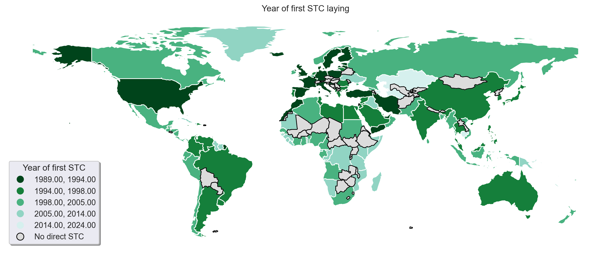
###### _Figure. %&%&%N. Map of first STC cable laying year_

### High(country) level STC

#### Distribution of STC between countries
The high level data aggregate the territorial information into the country level, which includes the mainland, dependent areas and overseas territories.(@nationsonline_2022_countries) This makes some small oversea island be in part of its administrative territories, for example Guam is an unincorporated territory of the US in western pacific Ocean(@usdoi_2016_definitions) but it is responsible for 7 out of 20 STCs connection between East Asia and West America(@telegeography_2022_submarine). This leaves 396 edges connections across 183 countries.

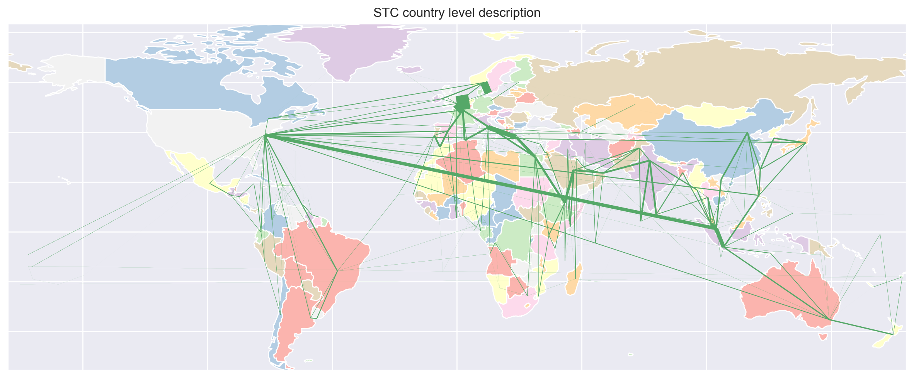
###### _Figure. %&%&%N. Country level connection_

The Figure %&%&%& presents the visualization of the country level STC connection, where each node is the representation of one country and there is at least one edge directly connect to it. The edge width is proportional to the count of STCs in charge of the end-to-end connection between two nodes.


###### _Figure. %&%&%. Country degree in histogram_

Combined to that, the distribution of this result shows a high clustering of the domestic connection in south east asia and europe. As the majority of the countries are having less than 25 direct STC connection to other states, in this case the design of STC tend to build a loosen and distributed network in a small area. Countries such as $K_{Indonesia}=224$, $K_{United States}=216$, $K_{United States}=118$ are way outnumbered than rest of 180 countries accounting 26% of global landing station count. Such, these countries are tend to have more redundancy cables than the rest of the world. This network has the edge density = 1/17, this ratio indicates the gap between actual edge and the max possible edge.

#### Bandwidth shortage due to the nature growth

Despite the development of the local cashing services(eg. CDN) over last two decades, increased investments in STC by the tech giants and continued construction of data centers around the globe, the demand on the international bandwidth seem to increase in the next few year according to the estimation and statistics from ITU(ITU, 2022). 

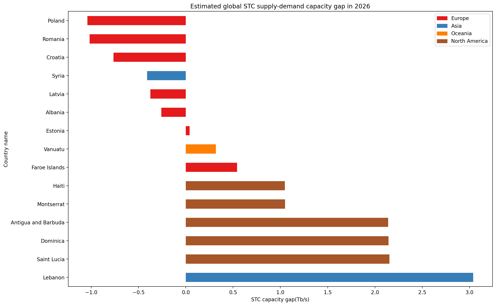
###### _Figure. %&%&%N. Country most vulnerable to international bandwidth shortage_

Figure %&%&%& shows the top 10 countries who have the risk to overcome the gap between international bandwidth provided by the STC and increasing internet services demand from its people. Eventhough Poland, Romania, Croatia are most vulnerable to this situation, in reality as members of the Europe union the actual gap is less than the paper result as the bandwidth deficit can be covered by TTC from adjacent countries. In contrast, countries with less political stability(eg. Syria) and geographically located in an island(eg. Vanuatu) will suffer more on this, especially during the internet rush hours. 

#### STC redundancy analysis

With over 100 yearly accident from human unintentional incident(eg. fishing dredge and anchoring) to nature hazard combined with the potential hostile attack for military purposes. (@mauldin_2017_cable) It is not hard to imagine the scenario where a country's internet services is disrupted by multiple cables losses at the same time. To simulate the consequences of such disruption in the worst case scenario, the strength of the internet is examined by assessing the remaining bandwidth after removing the cables with highest bandwidth. 


###### _Figure. %&%&%N. STC country bandwidth robustness compare_

Firstly, the countries with less than 3 redundant cables are considered as vulnerable to the internet connection. Historically speaking a simultaneous STC failure on 3 cables rarely happens, it is also advantageous if the country could still make essential communication with outside world under such scenario. Figure %&%&%& lists the share of countries based on their redundancy status. The STC vulnerable countries can not obtain the STC connectivity, which could be critical for some island country or territories as the lack of the TTC means potentially loss 100% of the international bandwidth. 

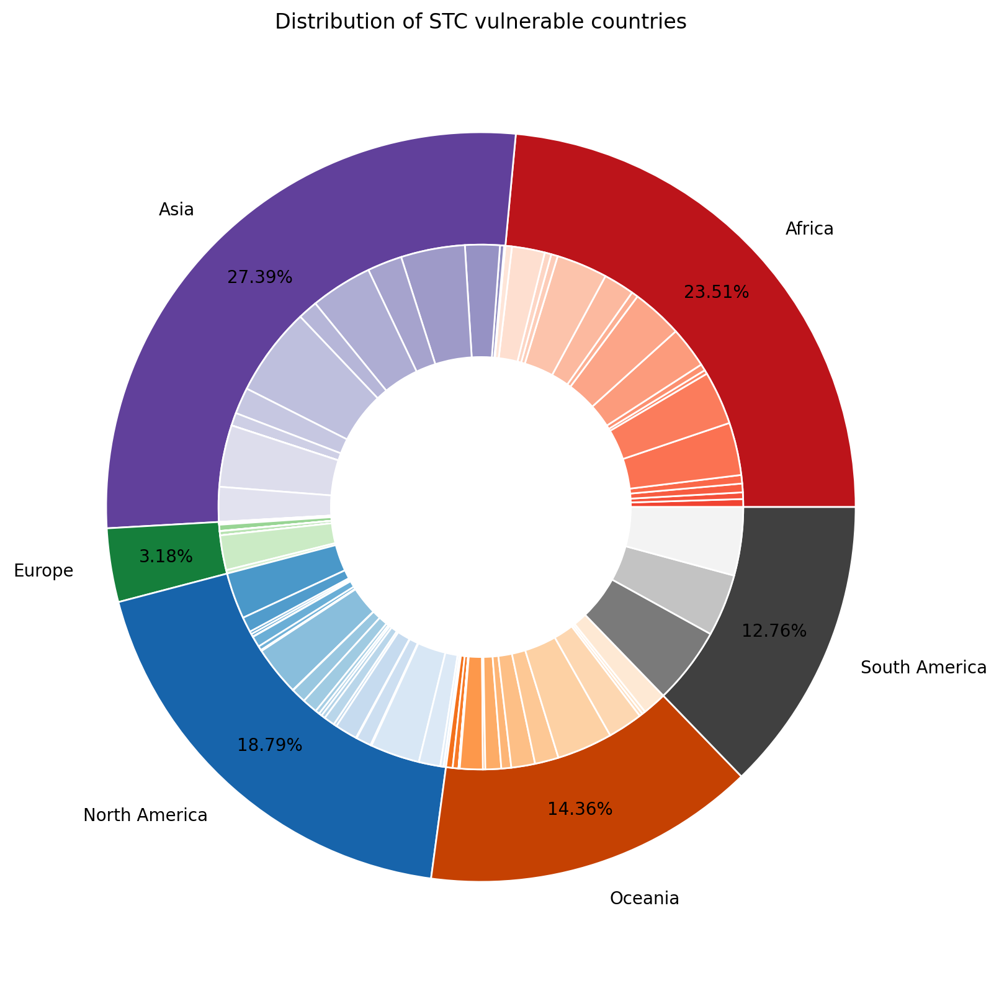
###### _Figure. %&%&%N. Spatial distribution of STC vulnerable countries_

To further investigate the STC robustness, Figure %&%&%& shows the spatial distribution of the STC vulnerable countries, a detailed result can be found in Figure %&%&%&-1. The outer ring is the share of total bandwidth from each continents where as the inner ring gives the portion for every county. Continents with high percentage are Asia > Africa > North America > Oceania > South America > Europe. According to the figure, Asia is the most vulnerable continent as it gives the highest figure, but the segment is made up by a handful countries with high bandwidth. In contrast to North America and Africa, a smaller sector from each country with a high number country count. As a case concerns the South America, which only consists 3 vulnerable countries: French Guiana, Guyana and Suriname with a evenly distributed bandwidth allocation. The countries deliver a summed capacity and cable count of 209.65Tb/s and 2.67cables/country. 

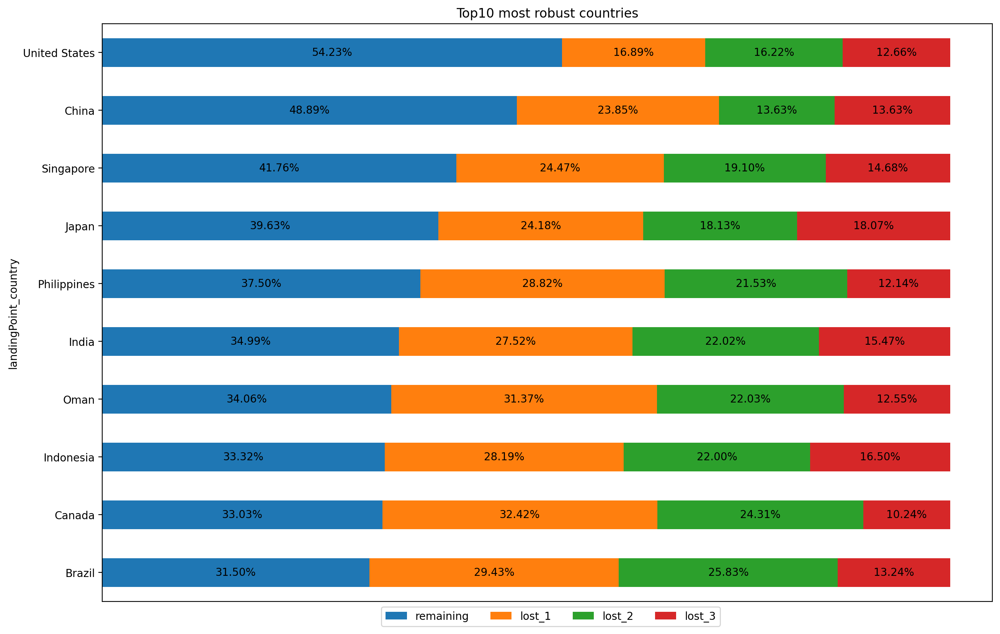
###### _Figure. %&%&%N. Scenarios of STC failures with most robust countries_


###### _Figure. %&%&%N. Scenarios of STC failures with lest robust countries_


There are 94 countries assigned to STC robust group, as each country can withstand the three or more losses on STC. As the result of cable failure, the country may suffer from a reduction on the international bandwidth capacity. However, losing one or two cables is more likely to happen in the real world. Figure %&%&%& and %&%&%&-1 shows the resultant remaining bandwidth in percentage to retain the internet connectivity if the top three widest cable fails. 

The USA is the leading player in remaining bandwidth after multiple cable failure, thanks to its excellent loosen cable distribution and availability of redundant cables. With cable edge $K_{usa}=29$ and estimated potential bandwidth of 1479.76Tb/s. After the connection loss of its widest cable Dunant, a reduction of 250Tb/s(16.89%) in the overall US bandwidth can be expected. Even in the worst case scenario in this study where top3 cables are failing at the same time, USA would still obtains remaining international bandwidth capacity of 642.43Tb/s. This number is still higher than the actual demand.(41.16Tb/s in 2022)(@itu_2022_country) Besides than that, the continental USA is geographically adjacent to Canada and Mexico which may provide additional TTC bandwidth capacity if necessary.

A bad example of the cable distribution design is Isle of Man, as the result of disconnect in its widest cable Havhingsten/CeltixConnect-2, it would expect loss 98.66% of bandwidth, with remaining 1.42Tb/s remaining capacity from the rest of 3 cables.

### Low(landing station) level STC
To better understand how STC distributed across the world, author also concerns a detailed low-level route for the STC paths. The figure below outline the landing stations and the geographical path of the global STC connection. Table %^%^%+1 provides summarizing the quantitative data from the dataset.

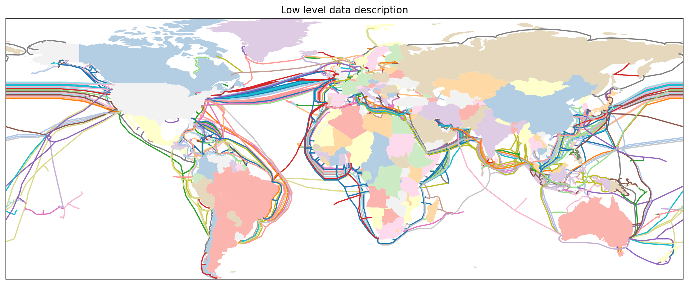
###### _Figure. %&%&%N. STC network in landing station level_

From the Table %^%^%+1 we can observe a highly skewed STC cable data distribution as the mean values are closed to 75% with a rapid increase in cable capacity, cable length, cable cost after that. 

| |country|landing station| cable capacity(Tb/s) | cable length(KM) | cable cost(million USD)|
|---|---|---|---|---|---|
|count |183.00|1335.00| 501.00 | 501.00 | 501.00|
|mean ||| 50.42 | 3406.04 | 119.61|
|std ||| 231.24 | 5986.72 | 182.44|
|min ||| 0.00 | 5.00 | 0.25|
|25% ||| 0.25 | 225.00 | 15.00|
|50% ||| 5.91 | 775.00 | 40.10|
|75% ||| 44.38 | 3472.00 | 122.00|
|max ||| 4000.00 | 45000.00 | 1007.78|
###### _Table. %^%^%N Summary for low level STC data_

#### Policy-Based Routing
Consider the nature of routing in a complex network, path from source node to destination can be selected from a vast options. Figure %&%&%&+1 shows an case of data communication between Yemen-India via STC. Although there are only six routes on the map, there are many alternative routes with longer distance and bypassing more landing stations can be discovered. 


###### _Figure. %&%&%N. STC route options from Yemen-India_

To approach the network routing while selecting the best route, a range of information also needs to be considered.(@baumann_2007_a) In this case, author compare the routes from Bude(UK) to Shanghai(China) to identify the shortest path under different use case of the data transmission.


###### _Figure. %&%&%N. Low-level shortest-path route ($C^S$)_


###### _Figure. %&%&%N. Low-level shortest-path route ($C^L$)_

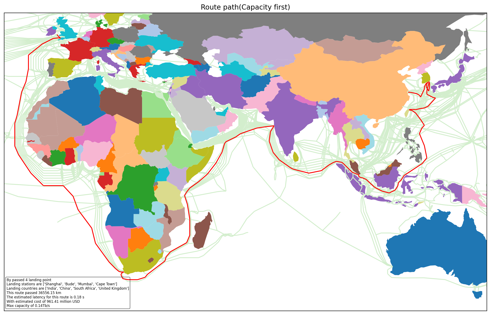
###### _Figure. %&%&%N. Low-level shortest-path route ($C^B$)_

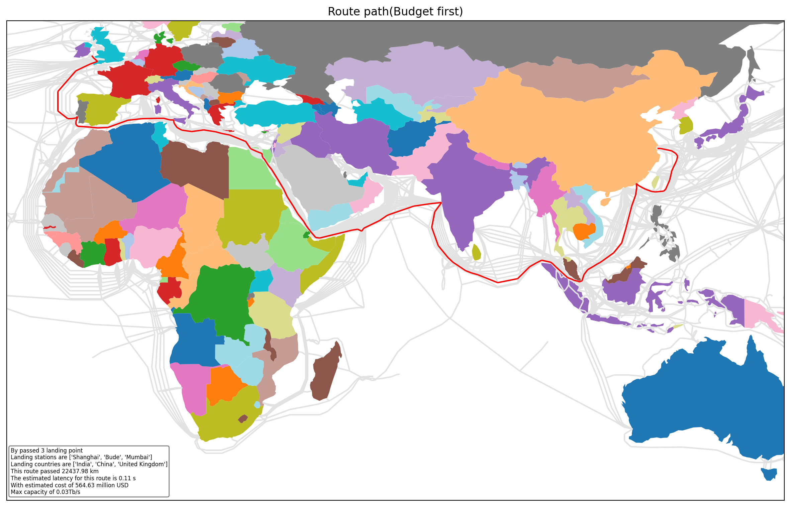
###### _Figure. %&%&%N. Low-level shortest-path route ($C^C$)_

As the Figure %&%&%&-3 to %&%&%& shown, the paths are chosen by the data packages based on their routing policies, in such instance, $C^B$ choose a geographically longer route to exchange for a wider bandwidth capacity in comparison to other routes. Using Mumbai(India) as the routing transit station is the common practice in this study case, the importance of Mumbai in global STC connection will be presented later study. It is also interesting to see a high overlap between the STC routes and some of the most important shipping trade routes, take $C^S$ as an example, the route passes English Channel, Strait of Gibraltar, Suez canal, Bab al-Mandab Strait, Malacca Strait before reaching its destination. It is risky for the cables by damaging from the anchors, as a large number of ships are right above the STC cables in the shipping route area. In addition to that cable density in these regions are usually higher than normal due to the narrow width alone the bank(205m for Suez canal), the damage from natural hazard or explosions may cause failure on multiple STCs.


#### Degree centralities

To assess the importance of each individual landing station, the degree centrality provides a quantitative measure to classify the nodes based on their cohesiveness. Accordingly, the count of adjacent edges for each landing station will be assessed. Figure %&%&%&+1 captures the results of the degree centrality based on the landing stations. Mumbai(India) is the headmost with $K_{Mumbai}=160$ and 0.43 degree centrality, followed by Shima(Japan) and Jeddah(Saudi Arabia), their high values can be explained by the geographic location as the transit countries. Japan is the gateway to connect Asia and Pacific ocean, similarly Saudi Arabia is located near the Suez Canal the shortest sea connection between Asia and Europe. Other side of the coin, the landing stations with the lowest can be found in the island countries or regions with only one cable connect to it eg. Aeng Batu Batu(Indonesia), Balluta Bay(Malta)

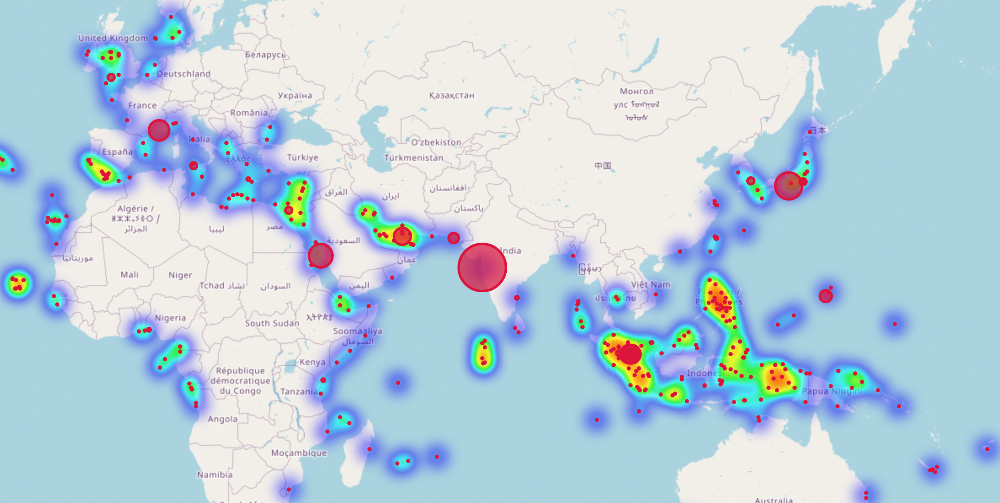
###### _Figure. %&%&%N. Low-level degree centrality map_

The landing stations with a high degree centrality are more significant in the STC network locally, arguably, such design is not ideal in terms of risk assessment. The high degree centrality node consists of a intensive connection, the failure in the node itself cause by unexpected accidents (eg. power blackout, riots, terrorist attack) would consequence in more serious damage to the communication globally as the data routing can not proceed to the succeeding landing station. Besides from landing stations mentioned above, Singapore is also extremely valuable to the STC network but can not directly be observed from the map. Due to the limited area in Singapore, the two landing stations(Changi North and Tuas) are only 35km apart and the accident in one landing station is likely to implicate another.


#### Betweenness centrality

To account for breakage risk of cable topology in the sea, one important issue that needs to be considered is the geographical distribution of the cable laying on the most optimal path. The betweenness centrality returns the ratio which the node is sitting alone the shortest path between any two nodes, it can be seem as a comprehensive measure of the routing path selection in terms of the possibilities. With different focus of the data routing policies, Figure %&%&%&+1 visualize the distribution of the betweenness centrality individually while the Table %^%^% +1 statistically summarize the value.


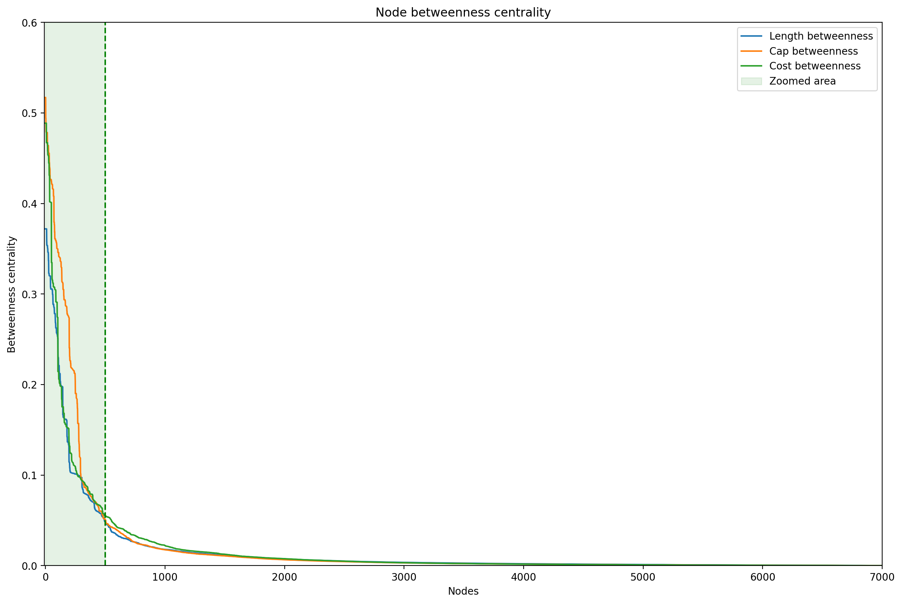
###### _Figure. %&%&%N. Betweenness centrality Overview_

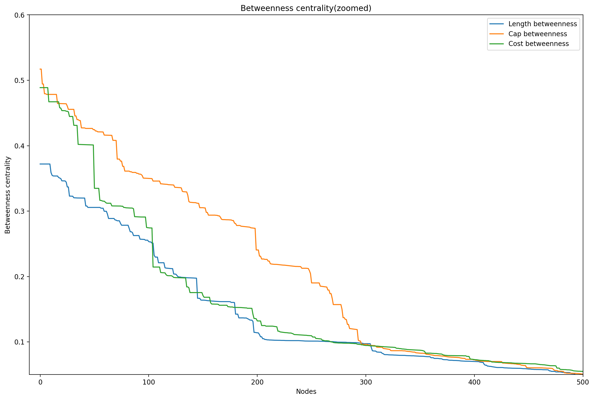
###### _Figure. %&%&%N. Betweenness centrality Zoomed_


||Latency|Cost|Capacity|
|---|---|---|---|
|count|7229|7229|7229|
|mean|0.015085355|0.016789418|0.019458784|
|std|0.043984581|0.051353499|0.064554104|
|min|0|0|0|
|25%|0.000892193|0.000609267|0.000675097|
|50%|0.002603469|0.002106302|0.002119711|
|75%|0.008613072|0.009043768|0.007870817|
|max|0.371998844|0.48875602|0.517119399|
###### _Table. %^%^%N Summary of low-level betweenness centrality_

The betweenness centrality for each routing policy gives a power-law distribution pattern in Figure %&%&%&-1 while Table %^%^% contains the relevant summary statistics. This is a bad design in network science, where the route choice is heavily dependent on a handful of nodes to maintain its performance. If the failure happens on the high betweenness centrality node, this design would result in a dramatically deteriorate of the efficiency of the data flow when the network is switched to the sub-optimal route(eg. takes more time to the destination, narrowed bandwidth, higher usage cost). A more detailed data pattern across different routing policies, Figure %&%&%& gives a zoomed view of the first 500 nodes from the Figure %&%&%&-1. It is evident that Bandwidth > Cost > Latency in the first 300 nodes, which mostly explained the reason why the big difference in the mean value with the contrast of little variation in 75% values from Table %^%^%. 

Therefore, a higher reduction in global STC bandwidth than the latency can be expected if any highlighted node/cable breaks down in the Figure %&%&%&+1 to Figure %&%&%&+3. Furthermore, the distribution of latency betweenness gives a shallowed curve with a lower standard deviation, which speaks to a more loosen network with higher resilience than other routing policies. In other words, the disconnect on a critical node would result in a more significant impact on the bandwidth capacity than transmission latency.

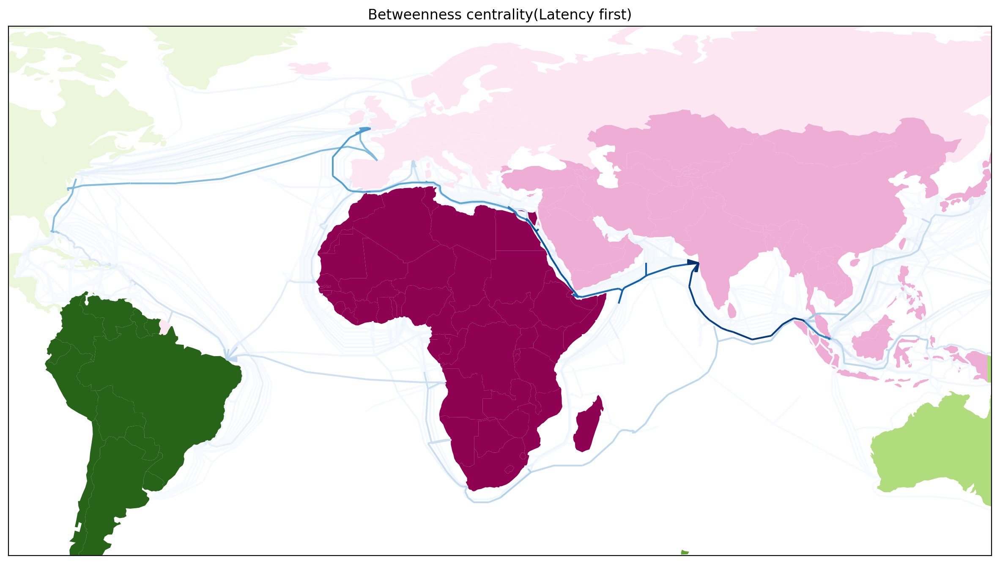
###### _Figure. %&%&%N. Low-level Betweenness centrality map($C^L$)_

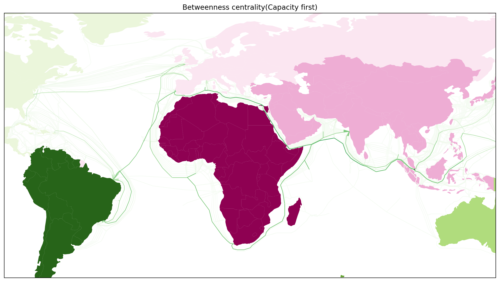
###### _Figure. %&%&%N. Betweenness centrality map($C^B$)_


###### _Figure. %&%&%N. Betweenness centrality map($C^C$)_

Figure %&%&%&+1 aggregates the betweenness results above to provide an summary of the nodes distribution to the adjacent cables. Of the three classes of routing policies, each group is showing different focus of patterns. it is important to illustrate the role of betweenness centralities by different types of distance measures through out global STC network.

Out of 3 routing policies, the spatial pattern reveals some informative clues. Firstly the latency betweenness measure of $C^L$ appears to maintain one highlighted connection between two geographic adjacent continents, especially in the route connecting from Singapore(Asia) to NewYork(North America) via UK(Europe). This result could be motivated by the demand on the financial sector(eg Stock exchange), as the data synchronization between financial data centers usually consists the feature of high requirement on realtime transmission. Secondary, the bandwidth betweenness shows a widespread distributed, this offers many benefit from reliability to data accessability. This distributed architecture does not propose critical bandwidth shortage problem to the remaining servers even the malfunction occurs on the most important node(eg India). As some of the web-services services can hosted on the existing cloud or CDN deployments, the widespread wide bandwidth cables are most clearly benefiting from the cloud hosted resources(eg. trending youtube videos) on the nearby CDN service stations. Finally, the cost betweenness highlights the necessary nodes required to achieve the minimum cost, showcase route from Singapore to Brazil via the India, UAE and South africa is high lighted, while this route avoids the most cable congested lane in Mediterranean Sea with a open connection in South africa. It is interesting to find out the overlap between $C^B$ and $C^C$ in East africa where the cables(eg 2Africa) are more advanced in budget controlling and bandwidth capacity.


###### _Figure. %&%&%N. Aggregated betweenness centrality map_

Figure %&%&%& aggregates the previous betweenness analysis into one visualization to provide a snapshot of top 5% most important route around the world. A high clustering in south east asia, MENA(Middle East and North Africa) and Celtic Sea, this finding could be utilized to simulate the consequence of the cable accident in those regions by estimating the impact on overall network functionality reduction.

### Network optimization

The Tonga volcano eruption on 20 Dec 2021 was believed as the largest volcanic eruption since the 1883 on record, which subsequently caused the destruction on its only STC on 15th Jan.(@cnn_2022_tonga)
After 38 days of lack of full access to internet, repair ship Reliance replaced 92km of STC between Tonga to Fiji.(@tom_2022_internet) During that time the communication with outside world was backed up with satellite telecommunication, but the traffic shrank around 99%.
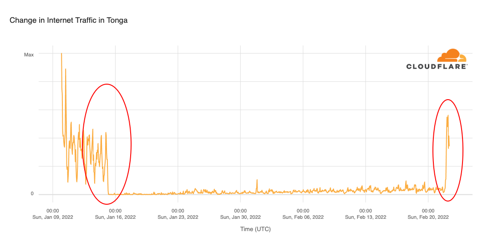
###### _Figure. %&%&%N. Tonga internet traffic during the STC failure_(@cloudflare_2022_internet)

#### Redundancy analysis

To overcome the fault scenario in tonga in the future, building redundant cables as the back up broadband services to compensate the impact caused by connectivity loss on primary cable. This acquires at least two cables connecting to the same landing station, regardless of whether they are STC or TTC. On this basis we adopts the Chinese post man algorithm to this problem, from its theory, the edges can be divided into two categories: in-degree and out-degree where each node consists at least one pair of the degrees. Out of many solutions, we found an optimal solution by minimizing the total length of the additional route planed to be built.

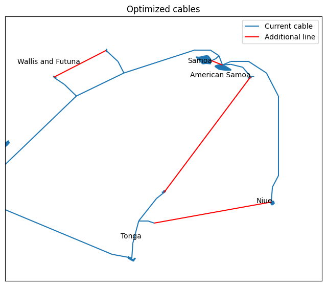
###### _Figure. %&%&%N. Planned STC optimization for Tonga_

This modification on the STCs would make the network more efficient by allowing more nodes to participate the information transformation, the average degree centrality was increased from 0.0588 to 0.0660 locally in this regions. Another positive note, network becomes more distributed by reducing the dependency on essential communication between the high degree nodes. Based on the analysis in Figure %&%&%&+1, a weaker rich-club effect in the optimized design is presented as the degree different is smaller, the average rich-club coefficient is now 0.2660 compared with 0.2741 before the improvement.

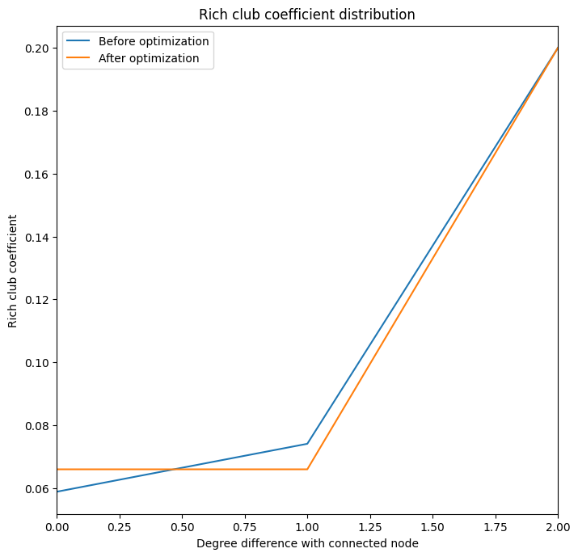
###### _Figure. %&%&%N. Rich-club analysis in Tonga_


#### Financial cost

Any modification on the existing system could bring extra cost, especially when laying the additional cables for extra redundancy. Here we will compare and contrast the cost of deploying additional STC and use of start link as the alternative technology in Tonga area. 

While analyzing the cost of the existing cables in the nearly water against with cable attributes by regression analysis, an adjusted R-squared of 0.963 suggests a good fit to the budget estimation of the planned cables. The two cables from Tonga to Niue and American Samoa are estimated of the length 618.18KM and 517.63KM with the cost \$13.29 and \$10.54 Million USD separately. These cables will directly benefit people in Tonga to Niue and American Samoa also provides a sub-optimal route for nearby countries such as French Polynesia and Cook Islands.

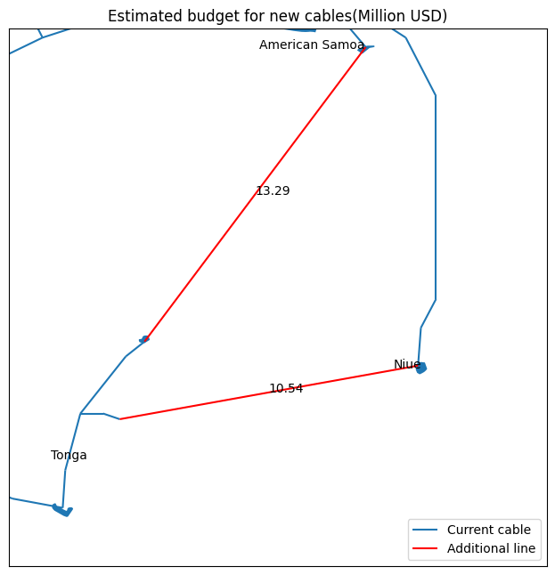
###### _Figure. %&%&%N. Estimate cost to deploy redundant cables_

With 25 years of industrial average service life, latter projection of the STC life expectancy will be based on that. Star link is the most common consumer level satellite internet services, as alternative technology to the STC. There are two parts of the costs to use the start link(@starlink_2022_starlink): hardware(\$599) and services(\$110/Mon), a functional working makes \$112 monthly capita cost can be expected in next 25 years. Meanwhile, the STC is sharing the same infrastructure cost regardless of the number of the internet users, the capita cost is inversely proportional to the number of subscribed user to the network. As the Figure %&%&%& shows, by the estimate from ITU in 2016 there are 55612 internet users in Tonga, Niue and American Samoa, it is cheaper to invest money in STC if more than 1862 units(individuals or companies) are willing to pay for the most standard data package in next 25 years. 

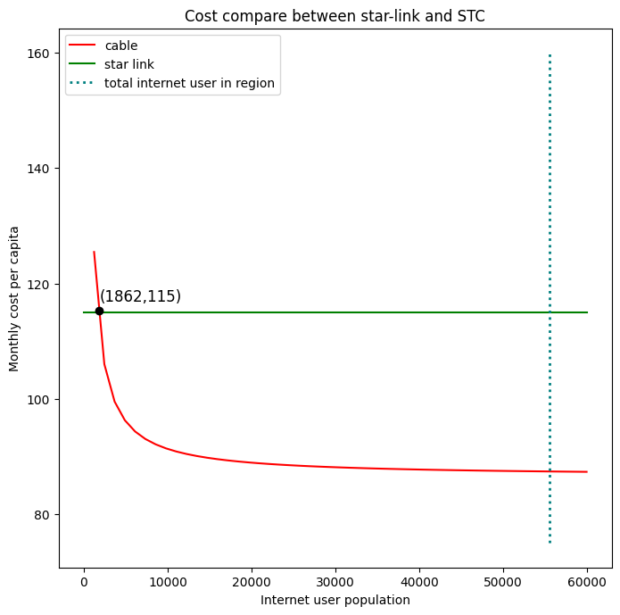
###### _Figure. %&%&%N. Cost of new STC compare with alternative technology_

## Discussion

This paper compared the topological structure of the STC and analyzed its vulnerability at the country level and route level. This section aims to comment on the findings and reflect on the limitations due to the real-world implications.

Firstly, the country level network consists of a wider range of areas by averaging the geographical differences and accessibility to the cable repair resources. For instance, different water conditions measurements, waterway and no-shipping zone, rich and poor countries. A more explicit analysis would help to clarify the damage results. Secondary, landlocked states are not included in this study, this was partly because of the lack of construction data in TTC. Consequently, the international bandwidth purely flowing through the TTC network is ignored. Thirdly, the bandwidth for some STCs are not publicly available, the estimation was based on the cable length, year of construction, budget cost and the status of existing cables in the nearby water. The actual capacity is less than estimation since the most cited metrics are potential capacity(max possible bandwidth) rather than lit capacity(actual running bandwidth).

As the focus on the topological structure of the STC network. 
Testing with results of the shortest-path analysis from UK to China and global betweenness centrality analysis using different distance measures to simulate the assortment of focus on the routing strategies. The shortest path finding only reveals some meteoritical path taken, in the real-world routers also need to consider the instantaneous availability of the cables and pre-defined rules in the routing table. The overlap in a handful of landing stations with the high value of betweenness centrality also suggests the potential risk of workload overwhelming on the popular landing stations when they are chosen by multiple routing policies simultaneously.

However, STC failure could also be dependent on varieties of geographical situations. Correspondingly high volumes of fishing, cargo shipping, water saltiness, earth tectonic hazard frequency. This study was motivated by the analysis of the route pattern in the real-world distribution when the weakness of STC can be targeted, the identification of adjustments for the quality infrastructure setup through avoidance of the missing connections. Yet, these arguments do not go far enough.

To overcome the vulnerability, redundancy is not the only available option to fill the missing capacity due to the absence of a primary cable. Instead, redundant cables are especially weak against human-led destructions. States can influence the cable deploying companies with a more frequent cable status patrol or by adding prevent cautions such as setting up cable protection zones to prevent the damage from fishing dredge or anchoring. While these precautions do not exclude the risk of natural hazards. Avoiding the seismic, volcanic, and landslide zone on the cable path is meaningful to prevent the destruction from the geologic activities before laying the cables. Thus the open communication and negotiation between ISPs and cable operators before the proper deployment helps to reduce the uncertainty of the network stability.

Another aspect also helps to better understand the vulnerability is the countermeasures in the internet backbone landing stations against the major events such as the unexpected hostile attacks on infrastructure or internet blackouts due to the natural hazard. Moreover, the dependency on energy infrastructure and cascading effects on the bandwidth deteriorates in the nearby states combined with the side effect on other internet-dependent businesses such as government administration, banking services and other digital services leading to a higher requirement for the cable and relative infrastructure protection. 
Additionally, developing emergency planning and keeping the open communication with the damage control crew with and in-hand repair tools(material, vessels). Moreover, the satellite internet communication devices would also help to enhance the robustness against STC failure. In view of this, keeping installing the redundant cables and utilizing satellite internet services as the backup technology by driving the diversification of the broadband access entrance can be considered a bright side to the global internet connectivity resilience.

## Conclusion

The submarine telecommunication cable network is an essential infrastructure that urgently needs to be protected, but academia and international legislation should not dismiss the negative impacts of the social and economical tensions, especially when the intentional attack(eg military and terrorist) can be achieved very easily. 

This paper modelled the global STC network and analyzed the topological vulnerabilities from 2 arguments(cable, landing station) in 2 visibility levels(country, local) as the mean of assessing the robustness of the alternative cables when the primary fails. 

The study firstly analysis all the states(n=183) with STC connections, the broadband threshold of internet shortage in the next few years remains low, but around 48% of the countries are formed in the most vulnerable class. The most vulnerable states must improve their telecommunication infrastructure quality to minimize the probability of internet blackout at the state level. Also, a further territorial investigation shows the high dependency on a handful of key landing stations on international internet connectivity. In addition, we also compared the impact of emerging internet services infrastructure(star-link), their usage as the emergency substitute might back the additional connectivity. From the standpoint of cable shortage in internet vulnerable countries and increasing participation of international tech giants recently, the future research will also take into consideration of larger international geopolitical contestations.

As the data communication plays the crucial role in the more than ever, the importance and vulnerability of the STC should seriously be recognized by relative expert from marine environmentalists to geopolitics.